# gitlab 搭建

ubuntu搭建gitlab参考链接：https://blog.csdn.net/qq_40026009/article/details/118632106

安装docker相关参考链接：https://mirror.tuna.tsinghua.edu.cn/help/docker-ce/


## ubuntu环境搭建docker 

首先安装依赖:

```
sudo apt-get install apt-transport-https ca-certificates curl gnupg2 software-properties-common
```


信任 Docker 的 GPG 公钥:

```
curl -fsSL https://download.docker.com/linux/debian/gpg | sudo gpg2 --dearmor -o /etc/apt/keyrings/docker.gpg
```


添加软件仓库:


```bash
echo \
  "deb [arch=$(dpkg --print-architecture) signed-by=/etc/apt/keyrings/docker.gpg] https://mirrors.tuna.tsinghua.edu.cn/docker-ce/linux/debian \
  $(lsb_release -cs) stable" | sudo tee /etc/apt/sources.list.d/docker.list > /dev/null
```


最后安装

```
sudo apt-get update
sudo apt-get install docker-ce
```


## 安装gitlab


### 安装并运行命令

```shell
sudo docker run --detach \
  --hostname gitlab.mczaiyun.top \
  --publish 443:443 --publish 80:80 --publish 222:22 \
  --name gitlab \
  --restart always \
  --volume /srv/gitlab/config:/etc/gitlab \
  --volume /srv/gitlab/logs:/var/log/gitlab \
  --volume /srv/gitlab/data:/var/opt/gitlab \
  gitlab/gitlab-ce:latest
```

hostname 域名 或 ip
publish 端口映射
restart 重启方式
gitlab/gitlab-ce:latest 镜像名称


### gitlab docker查看

```sh
quange@quange:/etc/apt/keyrings$ sudo docker ps
  PORTS                                                                                             
  df03e523cf98   gitlab/gitlab-ce:latest   "/assets/wrapper"   7 minutes ago   Up 7 minutes (healthy)   0.0.0.0:80->80/tcp, :::80->80/tcp, 0.0.0.0:443->443/tcp, :::443->443/tcp, 0.0.0.0:222->22/tcp, :::222->22/tcp   gitlab
```

可知docker id是df03e523cf98


gitlab docker保存修改

```
docker commit df03e523cf98
```


### 配置gitlab用户信息


```
u=User.where(id:1).first 			# u定义为root用户
u.password= 你的密码 				# 设置root密码, 默认最低密码强度为8位密码，否则失败
u.password_confirmation= 你的密码 	# 确认当前密码
u.save! 							# 保存操作
quit 								# 退出交互界面
```


```shell
quange@quange:~$ sudo docker exec -it df03e523cf98 bash
root@gitlab:/# gitlab-rails console
--------------------------------------------------------------------------------
 Ruby:         ruby 2.7.5p203 (2021-11-24 revision f69aeb8314) [x86_64-linux]
 GitLab:       15.0.3 (418555ba819) FOSS
 GitLab Shell: 14.3.0
 PostgreSQL:   13.6
------------------------------------------------------------[ booted in 51.13s ]


Loading production environment (Rails 6.1.4.7)
irb(main):001:0> 
irb(main):002:0> 
irb(main):003:0> u=User.where(id:1).first
=> #<User id:1 @root>
irb(main):006:0> u.password=509509509
=> 509509509
irb(main):007:0> u.password_confirmation=509509509
=> 509509509
irb(main):008:0> u.save!
=> true
irb(main):009:0> quit
root@gitlab:/#
```


### 配置gitlab邮件发送

参考链接：https://www.shuzhiduo.com/A/ZOJPEpPy5v/

邮件发送配置：https://www.csdn.net/tags/MtTaEgwsOTI0ODY1LWJsb2cO0O0O.html

执行 `gitlab-rails console`进入控制台。 然后在控制台提示符后输入下面的命令 发送一封测试邮件：Notify.test_email('chuquan_wu@163.com', '邮件标题', '邮件正文').deliver_now

sh: 1: /usr/sbin/sendmail: not found报错。

https://cloud.tencent.com/developer/article/1792473

最近的几个版本中也存在,貌似是版本固有问题


### 进入Gitlab网页

在google浏览器打开地址192.168.1.8，在登陆页面输入上述用户名（root）,密码（509509509），即可访问gitlab

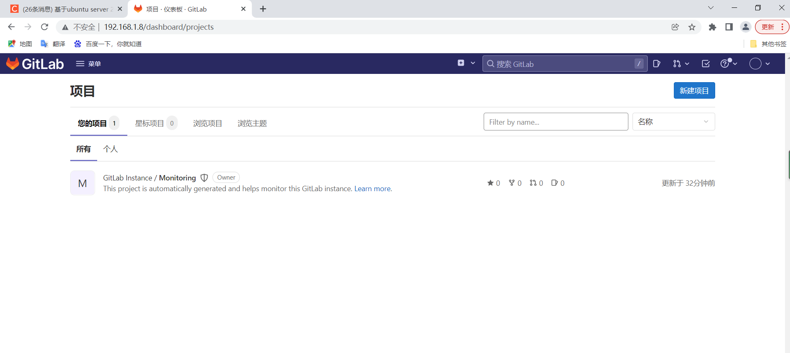


## gitlab网页端操作


### 1、修改配置

#### 1.1 默认语言配置

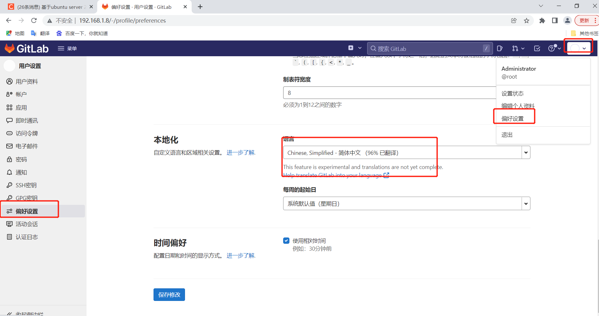


#### 1.2 增加ssh密钥

将路径下的密钥拷贝到网页上。

```
quange@quange:~/.ssh$ cat id_rsa_gitlab.pub 
ssh-rsa AAAAB3NzaC1yc2EAAAADAQABAAABAQCkYlMY70X7iCJn12rnZIZy7F5XpUPKEE9VEfIIL271EJw1oWMg+fOGLeKPQUzGZXHXemE3Xuq/A/sFnyN/FAGJ1OyQfUvaJzN0QXA+tqMuWZUC7hULcEj7AyCbbKHevKg7jyIVoLZ/QU4cYcNsGpAziYpApv8ja8sLKVpupEr/ADCWYa9W3M5capRw/tVZZMFNOtgK1uJzS2fzg0ZwU4hNayLs0hEeSZsVu+ahaq0C+JSvhRWP6TRlCZmofWb7KwSAUBrxKsuaBIXhUxwc8AV8uKaXx+ZCFkM0mzYdifSE2QdzIb8mcg2Av54l+/Uokeor6totQYooVXa5RCNhAbGH chuquan_wu@163.com
```


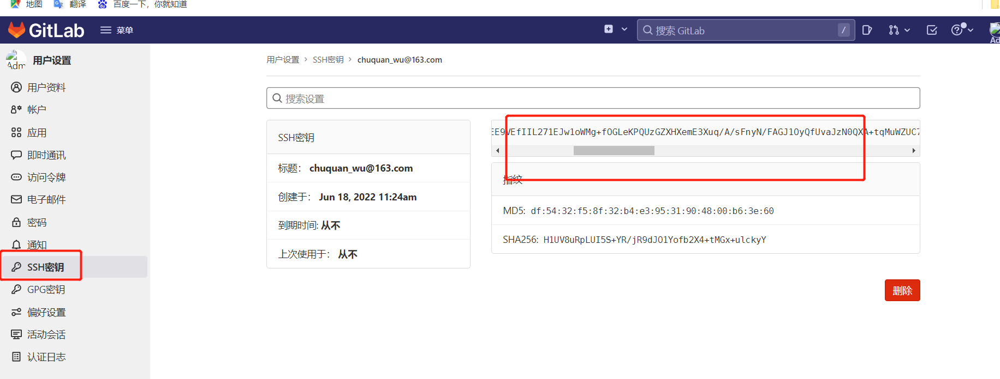


#### 1.3 增加项目组成员

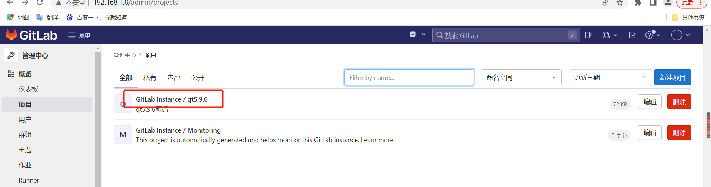


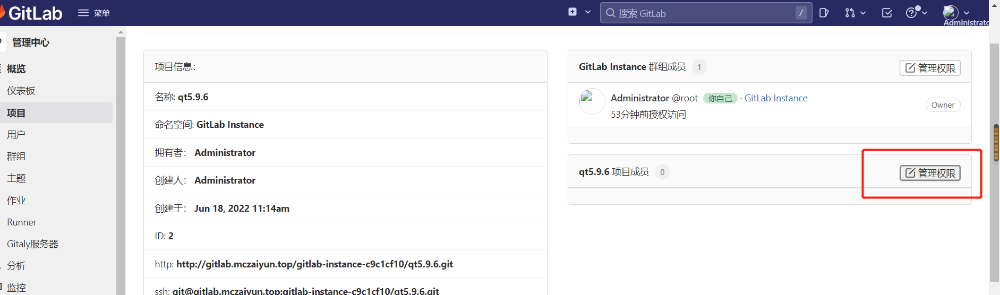


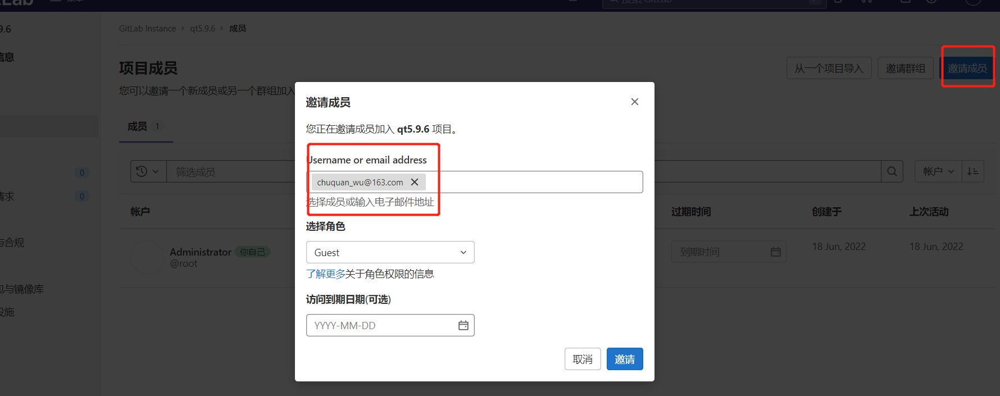


### 2、将git项目推送至gitlab


#### 2.1 在gitlab上创建一个空项目

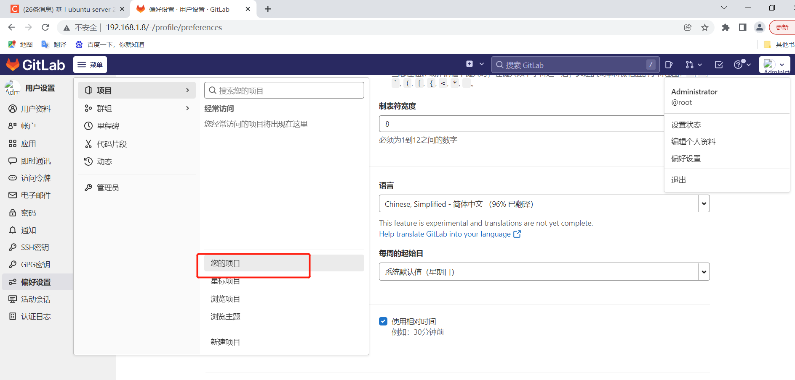


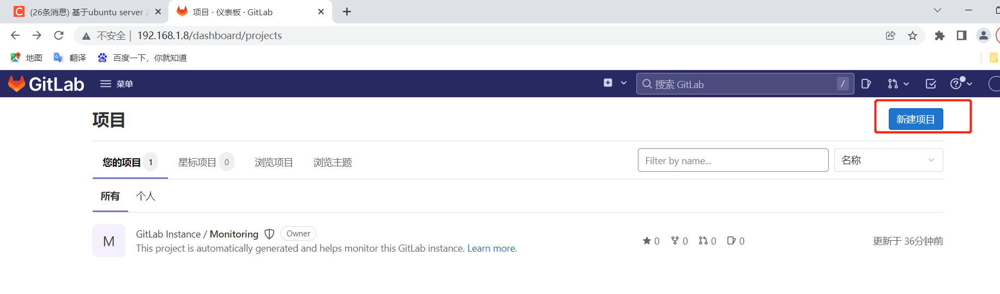


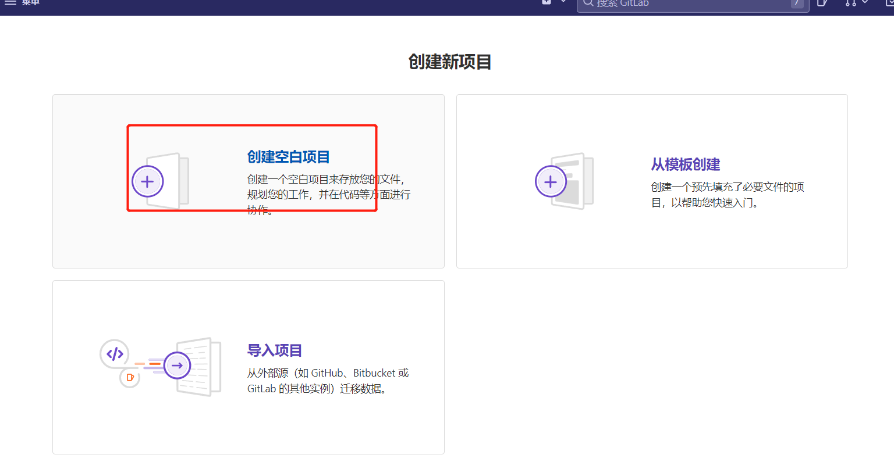

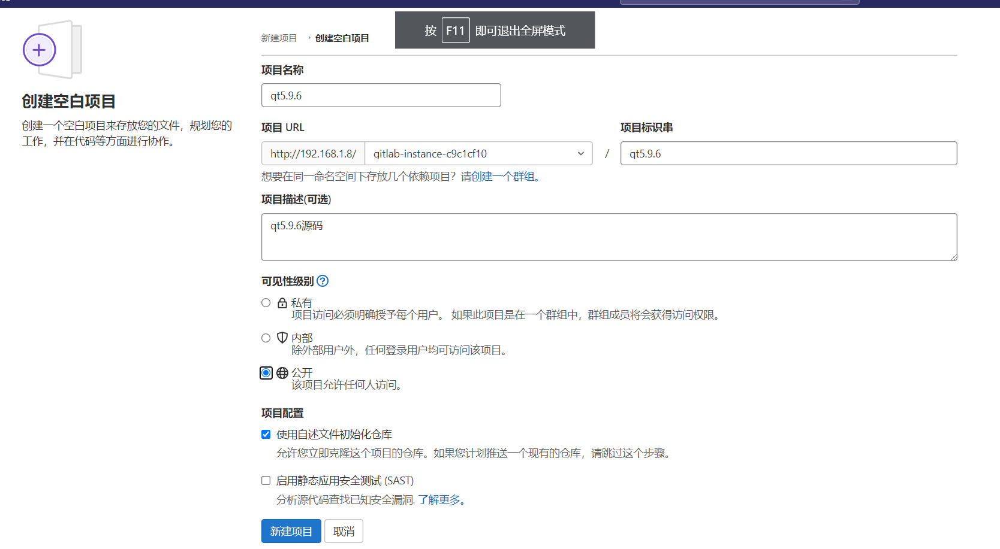


#### 2.2 创建一个简单git本地仓库


```
mkdir test
git init
touch .git_tempelate
touch newfile.txt
git add .
git commit
```


#### 2.3、使用Https直接将本地仓库Push到远端空仓库


```sh
git remote add origin http://192.168.1.8/gitlab-instance-c9c1cf10/test/test.git
git push -u origin master
```


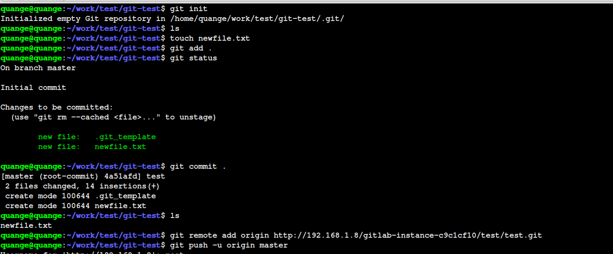


# SVN迁移到git


## 方案一

这个方案复杂，还未实现


参考链接1：https://blog.csdn.net/kulane/article/details/54019751

参考链接2：https://www.lovelucy.info/codebase-from-svn-to-git-migration-keep-commit-history.html


新建users.txt文件，并增加如下内容

```
wuchuquan=wuchuquan<chuquan_wu@163.com>
```


运行以下命令：

```
git svn clone --stdlayout --no-metadata -A users.txt file:///H/SVN_DB/qt5.9.6 dest_dir-tmp
```

注意，需要修改源路径是file:///H:/SVN_DB/qt5.9.6，改成file:///H/SVN_DB/qt5.9.6，否则会报找不到路径错误（参考路径1）。


如果出现用户名没找到，更新你的 `users.txt` 文件，然后

```sh
cd dest_dir-tmp 
git svn fetch
```


如果你的项目非常大，你可能需要重复上面的命令好几次，直到所有的 SVN commit 都被抓下来了：

```sh
git svn fetch
```


## 方案二：

参考链接：http://t.zoukankan.com/mq0036-p-14699655.html

该方案相对简单。

```
git svn clone file:///H/SVN_DB/qt5.9.6
```


```sh
git remote add origin http://192.168.1.8/gitlab-instance-c9c1cf10/qt5.9.6.git
git push -u origin master
```


如果git  remote add 错了路径，可以使用以下指令删除后，重新修改。

```
$ git remote rm origin #删除远程git仓库
```


### github参考方案：

github新建project,下面建议推送方法：

…or create a new repository on the command line


```shell
echo "# qt5.9.6" >> README.md
git init
git add README.md
git commit -m "first commit"
git branch -M main
git remote add origin https://github.com/quange-style/qt5.9.6.git

git push -u origin main
```

…or push an existing repository from the command line

```sh
git remote add origin https://github.com/quange-style/qt5.9.6.git
#或者采用git remote add origin git@github.com:quange-style/qt5.9.6.git
#git remote add origin gitown:quange-style/qt5.9.6.git
git branch -M main
git push -u origin main
```

参考链接：github上ssh密钥管理，或者是I:\学校\学习计划\第四篇：扩展\流媒体相关\git-svn相关\github项目创建搭建.doc

https://blog.csdn.net/weixin_37815019/article/details/110440234

由于之前已经搭建过github的ssh密钥（id_rsa_own.pub），所以直接使用git remote add origin gitown:quange-style/qt5.9.6.git来添加远程库。gitlab原理跟github雷同。如果采用https://地址方式添加，需要输入用户名跟密码（猜测应该是github登陆的用户名密码）。

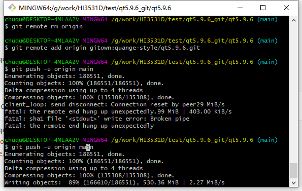