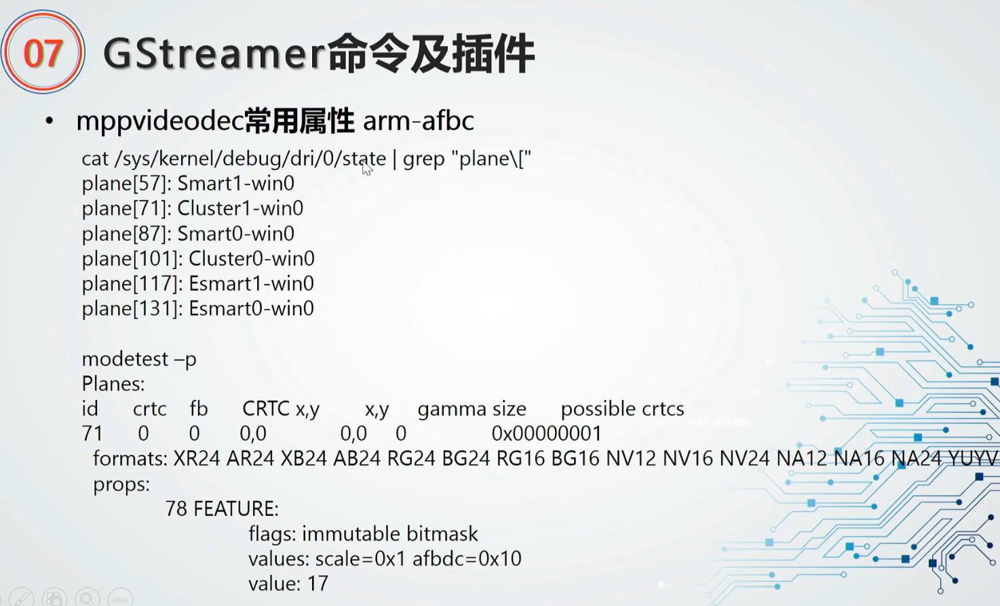

# 一、gstreamer开发相关

## 1.1 gstreamer应用开发

 

 

 

## 1.2 gstreamer插件开发

 

### 1、插件开发相关资料

**官方相关资料**：

https://gstreamer.freedesktop.org/documentation/application-development/advanced/pipeline-manipulation.html?gi-language=c

 

基类的插件有：

```sh
quange@quange-VirtualBox:~/Work/RXW/rk356x_v1.1/buildroot/output/rockchip_rk3568/build/gst1-plugins-bad-1.20.0/tools/element-templates$ ls
audiodecoder  audiosink  basesink       element  sinkpad-audio     sinkpad-template-video  srcpad-simple          videodecoder  videosink
audioencoder  audiosrc   basesrc        gobject  sinkpad-simple    srcpad                  srcpad-template        videoencoder
audiofilter   baseparse  basetransform  sinkpad  sinkpad-template  srcpad-audio            srcpad-template-video  videofilter 
```

 

 

插件的模板生成方法：

```sh
quange@quange-VirtualBox:~/Work/RXW/git-source/gst-template-main/mytest$ ../../../rk356x_v1.1/buildroot/output/rockchip_rk3568/build/gst1-plugins-bad-1.20.0/tools/gst-element-maker  myvideosink videosink
```


 

**gstreamer介绍：**

https://max.book118.com/html/2019/0302/8137062125002010.shtm

 

 

**gstreamer与glib的关系：**

https://blog.csdn.net/quicmous/article/details/117706271

 

**glib手册：**

https://docs.gtk.org/gobject/

https://docs.gtk.org/glib/

 

**gobject手册：**

https://docs.gtk.org/gobject/tutorial.html

https://docs.gtk.org/gobject/index.html

 

####  1.1 插件myvideosink 开发流程

 参考链接http://ericnode.info/post/gstreamer_intro/


查看一个类的相关信息：myvideosink 

```sh
quange@quange-VirtualBox:~/Work/RXW/rk356x_v1.1$ gst-inspect-1.0 myvideosink
...
GObject
 +----GInitiallyUnowned
       +----GstObject
             +----GstElement
                   +----GstBaseSink
                         +----GstVideoSink
                         		+----GstMyvideosink
```

 

myvideosink  中，GstMyvideosink和GstMyvideosinkClass必须放在结构体的第一位置，以便能够在子类、父类之间转换，实现面向对象。

其中GstMyvideosink为类的实例对象，里面可以存放运行时所需的**成员变量**；GstFakeSinkClass则为类，主要定义**成员函数**。

模板生成的代码里，函数**gst_myvideosink_class_init(GstMyvideosinkClass klass)**为类的初始化函数，主要用来设置其成员函数（即回调函数），通过参数klass和各种宏，可以得到继承关系上的所有父类，以便覆盖父类的成员函数。一方面将自己的函数设置到GstElement提供的框架中，实现更细分的功能；另一方面，自身定义了一些接口函数（并提供默认实现）提供给子类。

模板中已经包含了GObjectClass所属的set_property和get_property函数、GstElement所属的change_state函数。其中myvideosink  中只有sink pad，需要定义sink pad template；myvideofilter需要定义src pad和sink pad的template。其他函数则在下面进行说明。

**gst_myvideosink_class_init (GstMyvideosinkClass * klass)**为对象的初始化函数，对GstMyvideosink的成员变量进行初始化。


### 2、fakesink 插件

插件源码位置：

gstfakesink.c (buildroot\output\rockchip_rk3568\build\gstreamer1-1.20.0\plugins\elements)

 

https://blog.csdn.net/zzs0829/article/details/110520760

 

### 3、gsttee 插件

插件源码位置：

gsttee.c(buildroot\output\rockchip_rk3568\build\gstreamer1-1.20.0\plugins\elements)

实现push 模式的_chain()和pull模式的_get_range()函数

https://gstreamer.freedesktop.org/documentation/plugin-development/advanced/scheduling.html?gi-language=c


### 4、gstvideotestsrc插件讲解


参考链接http://ericnode.info/post/gstreamer_intro/


查看一个类的相关信息：videotestsrc

```sh
quange@quange-VirtualBox:~/Work/RXW/rk356x_v1.1$ gst-inspect-1.0 videotestsrc
...
GObject
 +----GInitiallyUnowned
       +----GstObject
             +----GstElement
                   +----GstBaseSrc
                         +----GstPushSrc
                               +----GstVideoTestSrc
```

 

videotestsrc中，GstVideoTestSrc和GstVideoTestSrcClass必须放在结构体的第一位置，以便能够在子类、父类之间转换，实现面向对象。

其中GstVideoTestSrc为类的实例对象，里面可以存放运行时所需的**成员变量**；GstVideoTestSrcClass则为类，主要定义**成员函数**。

模板生成的代码里，函数**gst_video_test_src_init (GstVideoTestSrc * src)**为类的初始化函数，主要用来设置其成员函数（即回调函数），通过参数klass和各种宏，可以得到继承关系上的所有父类，以便覆盖父类的成员函数。一方面将自己的函数设置到GstElement提供的框架中，实现更细分的功能；另一方面，自身定义了一些接口函数（并提供默认实现）提供给子类。

模板中已经包含了GObjectClass所属的set_property和get_property函数、GstElement所属的change_state函数。其中videotestsrc中只有src pad，需要定义sink pad template.。

**gst_video_test_src_class_init (GstVideoTestSrcClass * klass)**为对象的初始化函数，对GstVideoTestSrc的成员变量进行初始化。


#### 4.1 BaseSrc的初始化

如下图所示:


GstBaseSrc的class_init中设置了GstElement的change_state回调和pad_active回调:

- gstelement_class->change_state = GST_DEBUG_FUNCPTR (gst_base_src_change_state);;
- gst_pad_set_activatemode_function (pad, gst_base_src_activate_mode);

如上图所示，GstElement框架调用`gst_base_src_activate_mode()` （由外部调用，插件或者进程），以push模式激活src pad。在`gst_base_src_start()`中，调用了回调函数`start()`。如果videotestsrc中有定义该回调（这里为**gst_video_test_src_start()**），则调用，一般用进行设备的初始化。其中函数`gst_pad_mark_reconfigure()`将pad标识为需要进行协商，以便后续的过程中与downstream的插件进行协商和配置。

接下来，GstElement调用`gst_base_src_change_state()`（由外部调用，插件或者进程），将状态切换为playing。其中`gst_base_src_set_playing()`里调用`gst_pad_start_task()`，将`gst_base_src_loop()`函数设置为source组件的任务处理例程，循环调用，由此在push模式下，从整个组件链条的最上端，开始将数据往下推送。

任务处理循环调用流程：最终调用到videotestsrc类的成员函数gst_video_test_src_fill生成视频数据，再通过gst_pad_push发送给downstream

**gst_base_src_loop**->gst_base_src_get_range->(bclass->create)gst_base_src_default_create ->

(bclass->fill)gst_push_src_fill->(pclass->fill)gst_video_test_src_fill


**gst_base_src_loop**->gst_pad_push


#### 4.2 pad协商:

##### 1、videotestsrc协商

在`gst_base_src_loop()`中，有如下代码:

```c
  /* check if we need to renegotiate */
  if (gst_pad_check_reconfigure (pad)) {
    if (!gst_base_src_negotiate_unlocked (src)) {
      gst_pad_mark_reconfigure (pad);
      if (GST_PAD_IS_FLUSHING (pad)) {
        GST_LIVE_LOCK (src);
        goto flushing;
      } else {
        goto negotiate_failed;
      }
    }
  }
```

每次都会检查是否需要重新进行协商，以便应对配置的动态变化。如上所述，在初始化时标识了需要进行reconfigure，因此videotestsrc开始进行协商。该过程会询问很多东西，但最重要的是caps和allocation。

流程如下图所示:


在`gst_base_src_negotiate()`中，有机会调用子类的negotiate函数，如果子类没有设置，则用BaseSrc的默认协商函数`gst_base_src_default_negotiate()`，这里使用默认函数。

在该函数中，使用gst_pad相关函数执行query_caps。发出query后，在VideoEncoder类中，由其sink pad的query处理函数`gst_video_encoder_sink_query()`来响应。在里面调用`encoder_class->sink_query`，这里使用默认函数`gst_video_encoder_sink_query_default()`，由该函数处理所有的query。针对caps，调用`gst_video_encoder_sink_getcaps()`，如果子类实现了`klass->getcaps()`，则由子类决定sink pad具有什么样的caps；否则调用`gst_video_encoder_proxy_getcaps（）`，从template上获得caps。

在VideoEncoder回应了caps query之后，BaseSrc获得TestEnc sink pad的caps，然后调用fixate函数，根据得到的caps来确定实际src pad输出的格式。其中`bclass->fixate`需由子类实现，以便确定输出格式，包括宽、长等。

完成caps的协商之后，使用`gst_pad_get_current_caps()`获取当前的caps，然后调用`gst_base_src_prepare_allocation()`来设置内存的分配。该函数首先对VideoEncoder进行allocation查询。VideoEncoder调用`klass->propose_allocation`来应答。如果子类有对内存的特别需求，则必须实现该回调函数，否则执行默认处理函数将会返回NULL，意味着后续将会使用系统默认的allocator（即_“SystemMemory”_）。这里encoder采用硬件编码，必须存放到硬件的物理地址，因此实现了自定义的allocator来提供该物理地址。

**Memory Allocation**在GStreamer中比较重要，大家可以参考pwq文档，有专门的一章节`Chapter 15. Memory Allocation`进行讲解。不过其中`15.1.3. Implementing a GstAllocator`是空缺的… 关于GstBuffer、GstMemory和GstBufferPool的关系以及使用，估计得要另一篇文章才能说清楚。

TestEnc将allocator和pool设置在query中并返回给BaseSrc，BaseSrc调用`bclass->decide_allocation`来决定是否采纳该allocator，默认函数只做了一些有效性检查。然后解析出pool和allocator，并将其保存下来，留在以后使用。到这里，videotestsrc对TestEnc的协商完成。


##### 2、TestEnc与FileSink协商:

videotestsrc开始采集视频数据后，会调用gst_base_src_loop循环调用gst_base_src_get_range获取数据后，会调用gst_pad_push()`将数据由自身的src pad推到TestEnc的sink pad，GStreamer框架将会调用插件的chain函数进行处理，即VideoEncoder定义的`gst_video_encoder_chain()`。

gstvideoencoder.c在函数gst_video_encoder_sink_event_default (GstVideoEncoder * encoder,   GstEvent * event)，时间处理函数

```c
 case GST_EVENT_CAPS:
    {
      GstCaps *caps;

      gst_event_parse_caps (event, &caps);
      ret = gst_video_encoder_setcaps (encoder, caps);

      gst_event_unref (event);
      event = NULL;
      break;
    }
```

在其中，调用`gst_video_encoder_setcaps()`对sink pad进行配置，如下图中上方的虚线框内所示:


在第一个虚线框中，主要目的是为了建立input_state，用来保存输入数据的配置，子类必须实现`encoder_class->set_format`，将协商好的格式初始化到赢家中。

在VideoEncoder设置好input部分后，chain函数继续执行，将会调用`klass->handle_frame`，用来处理由TestSrc传入的视频帧数据，子类必须实现。参考TheoraEncoder的实现，发现在它的handle_frame中，首先会使用单键进行初始化，对src pad和output进行配置，如图中第二个虚线框内所示。

首先获取自己src pad的caps，并调用`gst_video_encoder_set_output_state()`将其传入来设置output格式。然后调用`gst_video_encoder_set_output_state()`，和downstream的插件（即FileSink）进行协商。协商过程中有两个回调函数提供给子类来实现，negotiate函数和decide_allocation函数，这里均使用默认实现。该协商过程和之前TestSrc与TestEnc的协商过程大致相同。

至此，三个插件的协商完成，确定了插件与插件之间的传输数据格式（`video/x-raw`和`video/x-h264`），设置了生成相互之间传输数据GstMemory所使用的allocator和pool。


#### 4.3数据流传输

协商完成之后，就开始实际数据传输。在这里的应用场景里，数据（即视频帧）的流向如下所示:

```
(device) videotestsrc --(video/x-raw)--> testenc --(video/x-h264)--> filesink (file)
```

videotestsrc从device中采集到raw格式数据，传输给TestEnc；TestEnc使用硬件编码将raw格式数据转换为H264格式，传输给FileSink；FileSink将其保存为文件。

大致的数据流描述如上，非常简单明了。但是对于插件开发者来说，代码执行就没那么简单了。

##### 1、videotestsrc Push to TestEnc

videotestsrc 将视频帧传输给TestEnc的执行流程如下图所示:


在此前初始化阶段提到，`gst_pad_start_task()`创建任务，使得`gst_base_src_loop()`被循环调用。在loop函数中，执行协商之后，将调用`gst_base_src_get_range()`。

该函数首先获取长度，然后调用`bclass->create`，这里使用默认实现`gst_base_src_default_create()`。该函数调用了`bclass->alloc`和`bclass->fill`，其中alloc获取GstBuffer用来存放数据，fill负责往GstBuffer填充数据。之后，由BaseSrc调用`gst_pad_push()`将帧发送给TestEnc。

在alloc中，调用`gst_base_src_get_buffer_pool()`获取pool，然后使用`gst_buffer_pool_acquire_buffer()`从pool中获取GstBuffer。**需要注意**，如果pool中已经没有可用的GstBuffer，即达到了pool的Max，那么该调用将会被阻塞，因此需要在TestEnc中将处理后的GstBuffer重新放回到pool中。

在fill中，从专有设备中获取数据，并填充到GstBuffer。如pwg所说，需要使用`gst_memory_map()`来获取可用的内存地址。而在自己实现的allocator中，此时才真正去分配物理内存并返回给TestSrc使用。

将数据填充到GstBuffer之后，调用`gst_pad_push()`，将该GstBuffer传递给downstream。随后TestEnc的sink pad的chain函数（即`gst_video_encoder_chain()`）被调用。这个函数由父类VideoEncoder实现，完成了大部分功能，包括设置input_state、计算时间、分配新的frame，而子类必须实现`klass->handle_frame`，处理获得的数据。

至此，视频帧便从Source传递到了Encoder。


##### 2、TestEnc Push to FileSink

视频帧在Encoder中以`GstVideoCodecFrame`结构体类型存在，该结构体同时表示了原始格式和编码后格式的视频帧，文中以frame表示。

在TestEnc定义的`test_enc_handle_frame()`中，编码原始数据，然后传递给downstream。参考了gstv4l2videoenc.c的实现，如下图所示:


首先从GstBuffer取出raw格式数据，进行编码处理。编码之后，调用`gst_video_encoder_get_oldest_frame()`获得一个新的frame，然后给该frame分配output_buffer，即传递给FileSink的GstBuffer。这里使用的allocator为TestEnc和FileSink协商得到的allocator，因此如果之前没有进行协商，这里会进行一次。

得到GstBuffer之后，调用`gst_buffer_fill()`将编码后的数据填充到里面，里面的实现是使用的`memcpy()`。此时，要传输的frame就准备好了，最后调用`gst_video_encoder_finish_frame()`。

finish_frame函数里在将GstBuffer传递给FileSink之前，会调用`encoder_class->pre_push()`，TestEnc仍有机会对frame进行一些处理，例如时间同步之类。从frame的output_buffer中得到GstBuffer后，release该frame，然后调用`gst_pad_push()`将GstBuffer传给downstream。

最后FileSink接收到GstBuffer，并从中获得H264格式的视频帧，保存到文件中。这样便完成了一次数据传输。


### 5、rkximagesink插件详解


#### xImageSink 简单描述


XImageSink 将视频帧渲染到本地或远程显示器上的可绘制对象 (XWindow)。此元素可以通过[GstVideoOverlay](https://gstreamer.freedesktop.org/documentation/video/gstvideooverlay.html#GstVideoOverlay)接口从应用程序接收窗口 ID，然后将在此可绘制对象中渲染视频帧。如果应用程序没有提供窗口 ID，则元素将创建自己的内部窗口并渲染到其中。


##### 缩放

由于标准的 XImage 渲染到可绘制对象没有缩放，XImageSink 将使用反向大写协商来尝试为可绘制对象获取缩放的视频帧。这是通过询问 peer pad 是否接受一些不同的上限来完成的，这在大多数情况下意味着管道中有一个缩放元素，或者生成视频帧的元素可以生成具有不同几何形状的它们。此机制在缓冲区分配期间处理，对于每个分配请求，视频接收器将检查可绘制几何图形，查看属性，计算所需视频帧的几何形状，然后检查对等板是否接受这些新上限。如果是这样，它将在视频内存中分配一个带有这个新几何形状的缓冲区，并用新的上限返回它。

##### 时间

XImageSink 创建一个线程来处理来自可绘制对象的事件。有几种事件可以分为两大类：输入事件和窗口状态相关事件。输入事件将被转换为导航事件并推送到上游以供其他元素对其做出反应。这包括诸如指针移动、按键/释放、点击等事件......即使数据没有流动（GST_STATE_PAUSED），其他事件也用于处理可绘制外观。这意味着即使元素暂停，它也会从可绘制对象接收公开事件并绘制具有正确边框/纵横比的最新帧。

##### 像素纵横比

将状态更改为 GST_STATE_READY 时，XImageSink 将打开与在属性或默认显示（如果未指定）。一旦此连接打开，它将检查显示配置，包括物理显示几何形状，然后计算像素纵横比。当 caps 协商发生时，video sink 将在 caps 上设置计算的像素纵横比，以确保传入的视频帧将具有此显示的正确像素纵横比。有时计算的像素纵横比可能是错误的，然后可以使用 财产。


##### 例子

```undefined
 gst-launch-1.0 -v videotestsrc ! queue ! ximagesink
```

用于测试反向协商的管道。当测试视频信号出现时，您可以调整窗口大小，并看到所需大小的缩放缓冲区将以**短暂的延迟到达**。这说明了如何分配所需大小的缓冲区。如果您取消队列，扩展几乎会立即发生。


```undefined
 gst-launch-1.0 -v videotestsrc ! navigationtest ! videoconvert ! ximagesink
```

用于测试**导航事件**的管道。将鼠标指针移到测试信号上时，您会看到**鼠标指针后面出现一个黑框**。如果您在视频的某处按下鼠标按钮，然后在其他地方松开鼠标按钮，您按下按钮的位置会出现一个绿色框，松开按钮的位置会出现一个红色框。（navigationtest 元素是 gst-plugins-good 的一部分。）


```undefined
 gst-launch-1.0 -v videotestsrc ! video/x-raw, pixel-aspect-ratio=\(fraction\)4\/3 ! videoscale ! ximagesink
```

这是在 videotestsrc 生成的视频帧上伪造 4/3 像素纵横比上限，在大多数情况下，显示器的像素纵横比将为 1/1。这意味着 videoscale 必须进行缩放以将传入的帧转换为与显示像素纵横比匹配的大小（在这种情况下从 320x240 到 320x180）。请注意，您可能必须为您的 shell 转义一些字符，例如“（分数）”。


##### 类的相关信息：

```
GObject 
    ╰── GInitiallyUnowned 
        ╰── GstObject 
            ╰── GstElement 
                ╰── GstBaseSink 
                    ╰── GstVideoSink 
                        ╰── rkximagesink
```


##### 实现的接口

```c
GstNavigation 
GstVideoOverlay
```


#### rkximagesink父类特性

##### 1、GstBaseSink

https://gstreamer.freedesktop.org/documentation/base/gstbasesink.html?gi-language=c#GstBaseSink

[GstBaseSink](https://gstreamer.freedesktop.org/documentation/base/gstbasesink.html#GstBaseSink)是 GStreamer 中 sink 元素的基类，例如 xvimagesink 或 filesink。[它是GstElement](https://gstreamer.freedesktop.org/documentation/gstreamer/gstelement.html#GstElement)之上的一层，为插件编写者提供了一个简化的接口。[GstBaseSink](https://gstreamer.freedesktop.org/documentation/base/gstbasesink.html#GstBaseSink)为您处理许多细节，例如：**预滚动、时钟同步、状态更改、推送或拉取模式下的激活以及查询**。

在大多数情况下，编写 sink 元素时，不需要从[GstElement](https://gstreamer.freedesktop.org/documentation/gstreamer/gstelement.html#GstElement)实现类方法或在 pad 上设置函数，因为 [GstBaseSink](https://gstreamer.freedesktop.org/documentation/base/gstbasesink.html#GstBaseSink)基础设施应该足够了。

[GstBaseSink 只](https://gstreamer.freedesktop.org/documentation/base/gstbasesink.html#GstBaseSink)支持一个 sink pad，应该命名为“sink”。sink 实现（[GstBaseSink](https://gstreamer.freedesktop.org/documentation/base/gstbasesink.html#GstBaseSink)的子类）应该在其 class_init 函数中安装一个 pad 模板，如下所示：


GstBaseSink子类配置sink焊盘代码：

```c++
static void gst_x_image_sink_class_init (GstRkXImageSinkClass * klass)
{
	  gst_element_class_set_static_metadata (gstelement_class,
      "Video sink", "Sink/Video",
      "A standard X based videosink", "Julien Moutte <julien@moutte.net>");

  gst_element_class_add_static_pad_template (gstelement_class,
      &gst_x_image_sink_sink_template_factory);

}

```


[GstBaseSink](https://gstreamer.freedesktop.org/documentation/base/gstbasesink.html#GstBaseSink)将正确处理预滚动。这意味着它将从状态更改返回[GST_STATE_CHANGE_ASYNC](https://gstreamer.freedesktop.org/documentation/gstreamer/gstelement.html#GST_STATE_CHANGE_ASYNC)到 PAUSED，直到第一个缓冲区到达此元素。基类将使用此预卷缓冲区调用 [预卷](https://gstreamer.freedesktop.org/documentation/base/gstbasesink.html#GstBaseSinkClass::preroll)v 方法，然后将状态更改提交到下一个异步挂起状态。

当元素设置为 PLAYING 时，[GstBaseSink](https://gstreamer.freedesktop.org/documentation/base/gstbasesink.html#GstBaseSink)将使用从[get_times](https://gstreamer.freedesktop.org/documentation/base/gstbasesink.html#GstBaseSinkClass::get_times)返回的时间同步时钟。如果此函数在开始时间返回[GST_CLOCK_TIME_NONE](https://gstreamer.freedesktop.org/documentation/gstreamer/gstclock.html#GST_CLOCK_TIME_NONE)，则不会进行同步。[通过将对象同步](https://gstreamer.freedesktop.org/documentation/base/gstbasesink.html#GstBaseSink:sync)属性设置为[FALSE](https://developer.gnome.org/glib/unstable/glib-Standard-Macros.html#FALSE:CAPS)可以完全禁用 同步。

同步后，将调用虚拟方法[渲染。](https://gstreamer.freedesktop.org/documentation/base/gstbasesink.html#GstBaseSinkClass::render)子类应最低限度地实现此方法。

[也支持在渲染](https://gstreamer.freedesktop.org/documentation/base/gstbasesink.html#GstBaseSinkClass::render) 方法中同步时钟的子类。这些类通常在渲染方法中接收缓冲区，然后在渲染时可能会阻塞时钟。一个典型的例子是音频接收器。这些子类可以使用[gst_base_sink_wait_preroll](https://gstreamer.freedesktop.org/documentation/base/gstbasesink.html#gst_base_sink_wait_preroll)来执行阻塞等待。

在 PLAYING 状态下接收到 EOS 事件后，[GstBaseSink](https://gstreamer.freedesktop.org/documentation/base/gstbasesink.html#GstBaseSink)将等待时钟到达最后一次 [get_times](https://gstreamer.freedesktop.org/documentation/base/gstbasesink.html#GstBaseSinkClass::get_times)调用的停止时间所指示的时间，然后发布 EOS 消息。当元素在 PAUSED 中接收到 EOS 时，预卷完成，事件进入队列，并在进入 PLAYING 时发布 EOS 消息。

[GstBaseSink](https://gstreamer.freedesktop.org/documentation/base/gstbasesink.html#GstBaseSink)将在内部使用[GST_EVENT_SEGMENT](https://gstreamer.freedesktop.org/documentation/gstreamer/gstevent.html#GST_EVENT_SEGMENT)事件来安排缓冲区的同步和剪辑。完全落在当前段之外的缓冲区将被删除。部分落在该段中的缓冲区被渲染（和预卷）。子类应该在需要时对自己进行任何子缓冲区剪辑。

[GstBaseSink](https://gstreamer.freedesktop.org/documentation/base/gstbasesink.html#GstBaseSink)默认会根据当前时钟时间和段信息以[GST_FORMAT_TIME](https://gstreamer.freedesktop.org/documentation/gstreamer/gstformat.html#GST_FORMAT_TIME)报告当前播放位置 。如果元素上没有设置时钟，则查询将被转发到上游。

当子类应配置自身以处理特定媒体类型时，将调用[set_caps函数。](https://gstreamer.freedesktop.org/documentation/base/gstbasesink.html#GstBaseSinkClass::set_caps)

当需要分配资源时，将调用[start](https://gstreamer.freedesktop.org/documentation/base/gstbasesink.html#GstBaseSinkClass::start)和[stop虚拟方法。](https://gstreamer.freedesktop.org/documentation/base/gstbasesink.html#GstBaseSinkClass::stop)任何 [preroll](https://gstreamer.freedesktop.org/documentation/base/gstbasesink.html#GstBaseSinkClass::preroll)、[render](https://gstreamer.freedesktop.org/documentation/base/gstbasesink.html#GstBaseSinkClass::render)和 [set_caps](https://gstreamer.freedesktop.org/documentation/base/gstbasesink.html#GstBaseSinkClass::set_caps)函数都将在 [start](https://gstreamer.freedesktop.org/documentation/base/gstbasesink.html#GstBaseSinkClass::start)和[stop](https://gstreamer.freedesktop.org/documentation/base/gstbasesink.html#GstBaseSinkClass::stop)调用之间被调用。

当[GstBaseSink](https://gstreamer.freedesktop.org/documentation/base/gstbasesink.html#GstBaseSink)接收到事件时，将调用[事件](https://gstreamer.freedesktop.org/documentation/base/gstbasesink.html#GstBaseSinkClass::event)虚拟方法。通常这个方法应该只被需要特别处理新闻段事件的非常特定的元素（例如文件接收器）覆盖。

当元素应该解锁它们在[渲染](https://gstreamer.freedesktop.org/documentation/base/gstbasesink.html#GstBaseSinkClass::render)方法中执行的任何阻塞操作时，将调用 [unlock](https://gstreamer.freedesktop.org/documentation/base/gstbasesink.html#GstBaseSinkClass::unlock)方法。[例如，当渲染](https://gstreamer.freedesktop.org/documentation/base/gstbasesink.html#GstBaseSinkClass::render)方法对文件描述符执行阻塞写入时，这非常有用 。

[max-lateness](https://gstreamer.freedesktop.org/documentation/base/gstbasesink.html#GstBaseSink:max-lateness)属性会影响接收器如何处理在接收器中过晚到达的缓冲区。当呈现时间（作为最后一段、缓冲区时间戳和元素 base_time 的组合）加上持续时间在时钟的当前时间之前时，缓冲区在接收器中到达得太晚了。如果帧晚于最大延迟，接收器将丢弃缓冲区而不调用渲染方法。如果同步被禁用、 [get_times](https://gstreamer.freedesktop.org/documentation/base/gstbasesink.html#GstBaseSinkClass::get_times)方法不返回有效的开始时间或 max-lateness 设置为 -1（默认值），则禁用此功能。子类可以使用[gst_base_sink_set_max_lateness](https://gstreamer.freedesktop.org/documentation/base/gstbasesink.html#gst_base_sink_set_max_lateness)来配置 max-lateness 值。

[qos](https://gstreamer.freedesktop.org/documentation/base/gstbasesink.html#GstBaseSink:qos)属性将启用 basesink 的服务质量功能，该功能收集有关时钟同步的实时性能的统计信息。对于接收器中接收到的每个缓冲区，都会收集统计信息并使用这些数字向上游发送 QOS 事件。例如，上游元素可以使用此信息来降低它们的处理速率。

[async](https://gstreamer.freedesktop.org/documentation/base/gstbasesink.html#GstBaseSink:async)属性可用于指示接收器从不执行 ASYNC 状态更改。此功能在处理非同步流或稀疏流时最有用。


##### 2、GstVideoSink

https://gstreamer.freedesktop.org/documentation/video/gstvideosink.html?gi-language=c#GstVideoSink

为视频接收器提供有用的功能和基类。

GstVideoSink 将配置默认基本接收器以丢弃迟于 20 毫秒到达的帧，因为这被认为是观察不同步帧的默认阈值。


#### rkximagesink关键点实现

##### 1、属性实现增加

属性相关，查看这个https://gstreamer.freedesktop.org/documentation/plugin-development/basics/args.html?gi-language=c

如果应用程序更改或请求属性的值，这些函数将收到通知，然后可以填写该值或采取该属性所需的操作以在内部更改值


主要增加了这三个drm kms相关的参数

```
  PROP_DRIVER_NAME,
  PROP_CONNECTOR_ID,
  PROP_PLANE_ID
```


具体表现为:

应用层可以通过gst-launch-1.0 -v videotestsrc ! queue ! rkximagesink **plane-id=101**  设置相关属性。


```c
static void
gst_x_image_sink_set_property (GObject * object, guint prop_id,
    const GValue * value, GParamSpec * pspec)
{
  GstRkXImageSink *ximagesink;
  g_return_if_fail (GST_IS_X_IMAGE_SINK (object));
  ximagesink = GST_X_IMAGE_SINK (object);
  switch (prop_id) {   
    case PROP_DRIVER_NAME:
      ximagesink->devname = g_value_dup_string (value);
      break;
    case PROP_CONNECTOR_ID:
      ximagesink->conn_id = g_value_get_int (value);
      break;
    case PROP_PLANE_ID:
      ximagesink->plane_id = g_value_get_int (value);
      break;
    default:
      G_OBJECT_WARN_INVALID_PROPERTY_ID (object, prop_id, pspec);
      break;
  }
}

static void
gst_x_image_sink_get_property (GObject * object, guint prop_id,
    GValue * value, GParamSpec * pspec)
{
  GstRkXImageSink *ximagesink;
  g_return_if_fail (GST_IS_X_IMAGE_SINK (object));
  ximagesink = GST_X_IMAGE_SINK (object);
  switch (prop_id) {
   
    case PROP_DRIVER_NAME:
      g_value_take_string (value, ximagesink->devname);
      break;
    case PROP_CONNECTOR_ID:
      g_value_set_int (value, ximagesink->conn_id);
      break;
    case PROP_PLANE_ID:
      g_value_set_int (value, ximagesink->plane_id);
      break;
    default:
      G_OBJECT_WARN_INVALID_PROPERTY_ID (object, prop_id, pspec);
      break;
  }
}

static void
gst_x_image_sink_class_init (GstRkXImageSinkClass * klass)
{  
    GObjectClass *gobject_class;
    gobject_class = (GObjectClass *) klass;
    gobject_class->set_property = gst_x_image_sink_set_property;
    gobject_class->get_property = gst_x_image_sink_get_property;

    /**
   * kmssink:driver-name:  
   * 如果您的系统具有多个 GPU，则可以选择使用哪个 GPU 来设置 DRM 设备驱动程序名称。 否则，使用内部列表中的第一个。
   */
  g_object_class_install_property (gobject_class, PROP_DRIVER_NAME,
      g_param_spec_string ("driver-name", "device name",
          "DRM device driver name", NULL,
          G_PARAM_READWRITE | G_PARAM_STATIC_STRINGS | G_PARAM_CONSTRUCT));

  /**
   * kmssink:connector-id:
	GPU 有多个输出连接器，例如：LVDS、VGA、HDMI 等。默认情况下，尝试第一个 LVDS，然后是第一个 eDP，最后是第一个连接的。
   */
  g_object_class_install_property (gobject_class, PROP_CONNECTOR_ID,
      g_param_spec_int ("connector-id", "Connector ID", "DRM connector id", -1,
          G_MAXINT32, -1,
          G_PARAM_READWRITE | G_PARAM_STATIC_STRINGS | G_PARAM_CONSTRUCT));

   /**
   * kmssink:plane-id:
	可能有多个与 CRTC 相关联的平面。 默认情况下，尝试使用给定 CRTC 的第一个平面。
   */
  g_object_class_install_property (gobject_class, PROP_PLANE_ID,
      g_param_spec_int ("plane-id", "Plane ID", "DRM plane id", -1, G_MAXINT32,
          -1, G_PARAM_READWRITE | G_PARAM_STATIC_STRINGS | G_PARAM_CONSTRUCT));
    
}
```


##### 2、指定焊盘

[相关代码查看：]: #1、GstBaseSink

https://gstreamer.freedesktop.org/documentation/plugin-development/basics/args.html?gi-language=c

https://gstreamer.freedesktop.org/documentation/plugin-development/advanced/request.html?gi-language=c


```c
static void
gst_x_image_sink_class_init (GstRkXImageSinkClass * klass)
{
  gst_element_class_add_static_pad_template (gstelement_class,
      &gst_x_image_sink_sink_template_factory);

}

static GstStaticPadTemplate gst_x_image_sink_sink_template_factory =
GST_STATIC_PAD_TEMPLATE ("sink",
    GST_PAD_SINK,
    GST_PAD_ALWAYS,
    GST_STATIC_CAPS ("video/x-raw, "
        "framerate = (fraction) [ 0, MAX ], "
        "width = (int) [ 1, MAX ], " "height = (int) [ 1, MAX ]")
    );
```


##### 3、元素元数据

https://gstreamer.freedesktop.org/documentation/plugin-development/basics/boiler.html?gi-language=c

元素元数据提供额外的元素信息。它配置有`gst_element_class_set_metadata`或 `gst_element_class_set_static_metadata`采用以下参数：

- 元素的长英文名称。
- 元素的类型，请参阅 GStreamer 核心源代码树中的 docs/additional/design/draft-klass.txt 文档以获取详细信息和示例。
- 元素用途的简要说明。
- 元素作者的姓名，可选后跟尖括号中的联系人电子邮件地址。

```c
static void
gst_x_image_sink_class_init (GstRkXImageSinkClass * klass)
{
    GstElementClass *gstelement_class;
    gstelement_class = (GstElementClass *) klass;
    gst_element_class_set_static_metadata (gstelement_class,
      "Video sink", "Sink/Video",
      "A standard X based videosink", "Julien Moutte <julien@moutte.net>");
}
```


##### 4、plugin_init 函数

https://gstreamer.freedesktop.org/documentation/plugin-development/basics/boiler.html?gi-language=c

一旦我们编写了定义插件所有部分的代码，我们就需要编写 plugin_init() 函数。这是一个特殊的函数，**它在插件加载后立即被调用**，并且应该返回 TRUE 或 FALSE，具体取决于它是否正确加载了任何依赖项。此外，在此函数中，应注册插件中任何受支持的元素类型。

```c
static gboolean
plugin_init (GstPlugin * plugin)
{
  if (!gst_element_register (plugin, "rkximagesink",
          GST_RANK_SECONDARY, GST_TYPE_X_IMAGE_SINK))
    return FALSE;

  GST_DEBUG_CATEGORY_INIT (gst_debug_x_image_sink, "rkximagesink", 0,
      "rkximagesink element");

  return TRUE;
}

GST_PLUGIN_DEFINE (GST_VERSION_MAJOR,
    GST_VERSION_MINOR,
    rkximage,
    "Rockchip X/DRM Video Sink",
    plugin_init, VERSION, GST_LICENSE, GST_PACKAGE_NAME, GST_PACKAGE_ORIGIN);

```

请注意，plugin_init() 函数返回的信息将缓存在中央注册表中。出于这个原因，函数总是返回相同的信息很重要：例如，它不能根据运行时条件使元素工厂可用。如果一个元素只能在某些条件下工作（例如，如果声卡没有被其他进程使用），这必须通过元素在不可用时无法进入 READY 状态来反映，而不是插件试图拒绝存在的插件


##### 5、pad调度方式

由该调度方式决定，不管哪种方式，最终都会gstbasesink->gstvideosink->rkimagesink的gst_x_image_sink_show_frame函数，显示视频数据。

在rkimagesink的父类GstBaseSink中，

https://gstreamer.freedesktop.org/documentation/plugin-development/advanced/scheduling.html?gi-language=c

https://blog.csdn.net/acs713/article/details/7794212

```c
gst_base_sink_init (GstBaseSink * basesink, gpointer g_class)
{
  gst_pad_set_activate_function (basesink->sinkpad, gst_base_sink_pad_activate);
  gst_pad_set_activatemode_function (basesink->sinkpad,
      gst_base_sink_pad_activate_mode);
 }
```


###### sink pull 模式调度实现如下：

gst_pad_set_activate_function使用宏GST_PAD_ACTIVATEFUNC配置了了(pad)->activatefunc函数指针为gst_base_sink_pad_activate；

调用用**gst_pad_set_active()**（具体是否调用这个，由最终调度模式决定）,运行的是(pad)->activatefunc函数指针。

```c
gst_base_sink_pad_activate
    -->gst_pad_activate_mode(pull)-
    -->activate_mode_internal-->GST_PAD_ACTIVATEMODEFUNC,运行的是(pad)->activatemodefunc函数指针，也即是gst_base_sink_pad_activate_mode。
```

注意：只有当上游 SCHEDULING 查询返回对 GST_PAD_MODE_PULL 调度模式的支持时，它才能执行此操作。

```c
static gboolean
gst_base_sink_pad_activate (GstPad * pad, GstObject * parent)
{
/* parse result of the query */
  pull_mode = gst_query_has_scheduling_mode (query, GST_PAD_MODE_PULL);
  gst_query_unref (query);

  if (!pull_mode) {
    GST_DEBUG_OBJECT (basesink, "pull mode not supported");
    goto fallback;
  }
}
```


gst_pad_set_activatemode_function使用宏GST_PAD_ACTIVATEMODEFUNC配置了了(pad)->activatemodefunc函数指针为gst_base_sink_pad_activate_mode；

```c
gst_base_sink_pad_activate_mode(pull)
    -->gst_base_sink_pad_activate_pull->(bclass->activate_pull)gst_base_sink_default_activate_pull
    -->gst_pad_start_task(gst_base_sink_loop)进入循环。
```


gst_base_sink_loop函数调度：gstbasesink->gstvideosink->rkimagesink

```c++
gst_base_sink_loop->
	-->gst_pad_pull_range//获取上游组件PAD数据
	-->gst_base_sink_chain_unlocked
    	-->bclass->render (basesink, GST_BUFFER_CAST (obj));//调度render函数指针 gstvideosink.c 的gst_video_sink_show_frame
		-->klass->show_frame(GST_VIDEO_SINK_CAST (bsink), buf)//调度show_frame函数指针 rkimagesink.c  gst_x_image_sink_show_frame
```


###### sink push模式调度实现如下：

推送模式下，源元件发起数据传输，是管道中的驱动力量；下游元件在chain函数中接收buffer.这样，就完成了从上游元件到下游元件的buffer传递。

在插件gstbasesink中，需要实现gst_base_sink_chain函数。

```c
gst_base_sink_chain-->
	gst_base_sink_chain_main-->
      gst_base_sink_chain_unlocked-->//(跟上述雷同)
    	-->bclass->render (basesink, GST_BUFFER_CAST (obj));//调度render函数指针 gstvideosink.c 的gst_video_sink_show_frame
		-->klass->show_frame(GST_VIDEO_SINK_CAST (bsink), buf)//调度show_frame函数指针 rkimagesink.c gst_x_image_sink_show_frame   
```


###### 调度模式是如何动态决定的

当一个pad被激活时，gst_element_pad_activate()函数被调用. 这个pad随后可以根据上游的能力（upstream capabilities,实际上为是否实现了XX_pull_range）来决定激活在push模式还是pull模式。如果一个pad没有activate函数(没有调用该gst_pad_set_activate_function函数配置pad的activatefunc指针函数)，gstreamer core将**默认为它激活在push模式**。

用得最多的数据流模式是推送模式。拉拽模式可以用在某些特殊情况下，如demuxer元件。


###### _getrange函数

当gst_pad_check_pull_range调用时，peer pad的getrange函数被调用。

事实上，前面说过，一个上游pad只有实现了getrange函数，才能被下游的pad以pull的模式调用它从而拉拽数据。

下游pad对getrange函数的调用，是通过以宏的形式---GST_PAD_GETRANGEFUNC (pad)来传递的。而该宏的赋值，是**上游的可以支持pull模式的元件**（决定该原件是否支持pull模式）在初始化的时候，调用gst_pad_set_getrange_function或者gst_pad_set_getrange_function_full设置的。

例如gsttee插件： 实现了_get_range，并且使用gst_pad_set_getrange_function安装回调函数。

```c
static GstFlowReturn
gst_tee_src_get_range (GstPad * pad, GstObject * parent, guint64 offset,
    guint length, GstBuffer ** buf)
{
  ret = gst_pad_pull_range (tee->sinkpad, offset, length, buf);

  if (ret == GST_FLOW_OK)
    ret = gst_tee_handle_data (tee, gst_buffer_ref (*buf), FALSE);
  else if (ret == GST_FLOW_EOS)
    gst_tee_pull_eos (tee);
  return ret;
}

static GstPad *
gst_tee_request_new_pad (GstElement * element, GstPadTemplate * templ,
    const gchar * name_templ, const GstCaps * caps){
gst_pad_set_getrange_function (srcpad,
      GST_DEBUG_FUNCPTR (gst_tee_src_get_range));
}

```


另外目测，没多少个插件实现该功能。

```c
--- gst_pad_set_getrange_function Matches (21 in 13 files) ----

gst_base_src_init in gstbasesrc.c (buildroot\output\rockchip_rk3568\build\gstreamer1-1.20.0\libs\gst\base) :   
gst_base_transform_init in gstbasetransform.c (buildroot\output\rockchip_rk3568\build\gstreamer1-1.20.0\libs\gst\base) :   gst_pad_set_getrange_function (trans->srcpad,
gst_download_buffer_init in gstdownloadbuffer.c (buildroot\output\rockchip_rk3568\build\gstreamer1-1.20.0\plugins\elements) :  
gst_ghost_pad_constructed in gstghostpad.c (buildroot\output\rockchip_rk3568\build\gstreamer1-1.20.0\gst) :     
gst_ghost_pad_constructed in gstghostpad.c (buildroot\output\rockchip_rk3568\build\gstreamer1-1.20.0\gst) :     
gst_queue2_init in gstqueue2.c (buildroot\output\rockchip_rk3568\build\gstreamer1-1.20.0\plugins\elements) :   
gst_tag_demux_init in gsttagdemux.c (buildroot\output\rockchip_rk3568\build\gst1-plugins-base-1.20.0\gst-libs\gst\tag) :  
gst_tee_request_new_pad in gsttee.c (buildroot\output\rockchip_rk3568\build\gstreamer1-1.20.0\plugins\elements) :   
gst_type_find_element_init in gsttypefindelement.c (buildroot\output\rockchip_rk3568\build\gstreamer1-1.20.0\plugins\elements) : 
_create_src_pad_pull in mxfdemux.c (buildroot\output\rockchip_rk3568\build\gst1-plugins-bad-1.20.0\tests\check\elements) :   
```


###### _chain函数

  当上游元件的pad调用gst_pad_push函数时，下游元件pad的chain函数被调用。

https://gstreamer.freedesktop.org/documentation/plugin-development/basics/chainfn.html?gi-language=c


[例如上述的:](#sink push模式调度实现如下:)

```c
static void
gst_base_sink_init (GstBaseSink * basesink, gpointer g_class)
{
  gst_pad_set_chain_function (basesink->sinkpad, gst_base_sink_chain);
  gst_pad_set_chain_list_function (basesink->sinkpad, gst_base_sink_chain_list);
}

static GstFlowReturn gst_base_sink_chain (GstPad * pad, GstObject * parent, GstBuffer * buf)
{
  return gst_base_sink_chain_main (basesink, pad, buf, FALSE);
}

static GstFlowReturn gst_base_sink_chain_list (GstPad * pad, GstObject * parent,    GstBufferList * list)
{
}
```


##### 6、事件函数

gstreamer内部事件


https://gstreamer.freedesktop.org/documentation/plugin-development/advanced/events.html?gi-language=c

**Downstream events:**

下游事件是通过**sink pad**的事件处理程序接收的。

下游事件可以通过两种方式传播：它们可以是带内（与缓冲区流一起序列化）或带外（立即通过管道传播，可能与处理缓冲区的流线程不在同一个线程中，跳过正在处理或在管道中排队的缓冲区）。最常见的下游事件（SEGMENT、CAPS、TAG、EOS）都用缓冲流序列化。


**Upstream events:**

上游事件由管道下游某处的元素生成（例如：视频接收器可能生成导航事件，通知上游元素鼠标指针的当前位置）。这也可能在应用程序请求时间接发生，例如，当应用程序在管道上执行搜索时，此搜索请求将被传递到接收器元素，该元素随后将生成上游搜索事件。

最常见的上游事件是搜索事件、服务质量 (QoS) 和重新配置事件。

可以使用该`gst_pad_send_event`函数发送上游事件，这个函数只是调用那个pad的默认事件处理程序。pads 的默认事件处理程序是`gst_pad_event_default`，它基本上将事件发送到内部链接的 pad 的对等点。因此上游事件总是到达元素的 src pad 并由默认事件处理程序处理，除非您覆盖该处理程序来自己处理它。

```c
static void
gst_base_sink_init (GstBaseSink * basesink, gpointer g_class)
{
  gst_pad_set_event_function (basesink->sinkpad, gst_base_sink_event);
}

static gboolean
gst_base_sink_event (GstPad * pad, GstObject * parent, GstEvent * event)
{
      switch (GST_EVENT_TYPE (event)) {
    case GST_EVENT_FLUSH_STOP:
      //指定序列化事件的特殊情况，因为我们不想获取 PREROLL 锁或检查我们是否正在刷新
      if (bclass->event)
        result = bclass->event (basesink, event);
      break;
      }
}

//rkimagesink实现event
static void gst_x_image_sink_class_init (GstRkXImageSinkClass * klass)
{
   gstbasesink_class->event = GST_DEBUG_FUNCPTR (gst_x_image_sink_event);
}

//实现对GST_EVENT_TAG 事件的处理（设置窗口title名称）
static gboolean gst_x_image_sink_event (GstBaseSink * sink, GstEvent * event)
{
  GstRkXImageSink *ximagesink = GST_X_IMAGE_SINK (sink);

  switch (GST_EVENT_TYPE (event)) {
    case GST_EVENT_TAG:{
      GstTagList *l;
      gchar *title = NULL;
      gst_event_parse_tag (event, &l);
      gst_tag_list_get_string (l, GST_TAG_TITLE, &title);
      if (title) {
        GST_DEBUG_OBJECT (ximagesink, "got tags, title='%s'", title);
        gst_x_image_sink_xwindow_set_title (ximagesink, ximagesink->xwindow,
            title);

        g_free (title);
      }
      break;
    }
  }
  return GST_BASE_SINK_CLASS (parent_class)->event (sink, event);
}

```


xwindow事件：

```c
gst_x_image_sink_change_state//GST_STATE_CHANGE_NULL_TO_READY
gst_x_image_sink_set_property//PROP_HANDLE_EVENTS（xwidow event 相关） PROP_HANDLE_EXPOSE(视频帧相关)
	-->gst_x_image_sink_manage_event_thread
    -->gst_x_image_sink_event_thread(创建或者控制停止线程处理函数)
  
gst_x_image_sink_event_thread
    -->gst_x_image_sink_handle_xevents
    	-->XCheckWindowEvent//循环读取事件，主要处理鼠标，键盘，窗口移动等相关事件
```


##### 7、查询函数

https://gstreamer.freedesktop.org/documentation/plugin-development/basics/queryfn.html?gi-language=c


```cc
static void gst_base_sink_init (GstBaseSink * basesink, gpointer g_class)
{
    gst_pad_set_query_function (basesink->sinkpad, gst_base_sink_sink_query);
    gstelement_class->query = GST_DEBUG_FUNCPTR (default_element_query);
}

static gboolean gst_base_sink_sink_query (GstPad * pad, GstObject * parent, GstQuery * query)
{
  bclass = GST_BASE_SINK_GET_CLASS (basesink);
  if (bclass->query)
    res = bclass->query (basesink, query);
  else
    res = FALSE;

  return res;
}

static gboolean default_element_query (GstElement * element, GstQuery * query)
{
  gboolean res = FALSE;

  GstBaseSink *basesink = GST_BASE_SINK (element);

  switch (GST_QUERY_TYPE (query)) {
    case GST_QUERY_POSITION:    {    
      break;
    }
    case GST_QUERY_DURATION:    {     
      break;
    }
    case GST_QUERY_LATENCY:    {     
      break;
    }
    case GST_QUERY_JITTER:
      break;
    case GST_QUERY_RATE:    
      break;
    case GST_QUERY_SEGMENT:    {     
      break;
    }
    case GST_QUERY_SEEKING:
    case GST_QUERY_CONVERT:
    case GST_QUERY_FORMATS:
    default:
      res = gst_pad_peer_query (basesink->sinkpad, query);
      break;
  }
  GST_DEBUG_OBJECT (basesink, "query %s returns %d",
      GST_QUERY_TYPE_NAME (query), res);
  return res;
}


//rkimagesink实现query
static void gst_x_image_sink_class_init (GstRkXImageSinkClass * klass)
{
   gstbasesink_class->query = GST_DEBUG_FUNCPTR (gst_kms_sink_query);
}

//实现GST_QUERY_ALLOCATION GST_QUERY_DRAIN事件处理（猜测主要是查询到事件，冲刷一帧数据）
static gboolean gst_kms_sink_query (GstBaseSink * bsink, GstQuery * query)
{
  GstRkXImageSink *self = GST_X_IMAGE_SINK (bsink);

  switch (GST_QUERY_TYPE (query)) {
    case GST_QUERY_ALLOCATION:
    case GST_QUERY_DRAIN:
    {
      gst_kms_sink_drain (self);
      break;
    }
    default:
      break;
  }

  return GST_BASE_SINK_CLASS (parent_class)->query (bsink, query);
}
```


##### 8、状态函数

https://gstreamer.freedesktop.org/documentation/plugin-development/basics/states.html?gi-language=c

```cc
//basesink 状态函数gst_base_sink_change_state实现
static void gst_base_sink_init (GstBaseSink * basesink, gpointer g_class)
{
    gst_pad_set_query_function (basesink->sinkpad, gst_base_sink_sink_query);
    gstelement_class->query = GST_DEBUG_FUNCPTR (default_element_query);
}

static GstStateChangeReturn gst_base_sink_change_state (GstElement * element, GstStateChange transition)
{
  GstStateChangeReturn ret = GST_STATE_CHANGE_SUCCESS;
  GstBaseSink *basesink = GST_BASE_SINK (element);
  GstBaseSinkClass *bclass;
  GstBaseSinkPrivate *priv;

  priv = basesink->priv;

  bclass = GST_BASE_SINK_GET_CLASS (basesink);

  switch (transition) {
    case GST_STATE_CHANGE_NULL_TO_READY:
     
      break;
    case GST_STATE_CHANGE_READY_TO_PAUSED:
     
      break;
    case GST_STATE_CHANGE_PAUSED_TO_PLAYING:
      
      break;
    default:
      break;
  }
 
{
    GstStateChangeReturn bret;

    bret = GST_ELEMENT_CLASS (parent_class)->change_state (element, transition);
    if (G_UNLIKELY (bret == GST_STATE_CHANGE_FAILURE))
      goto activate_failed;
  }

  switch (transition) {
    case GST_STATE_CHANGE_PAUSED_TO_PLAYING:
      
      break;
    case GST_STATE_CHANGE_PLAYING_TO_PAUSED:
    
      break;
    case GST_STATE_CHANGE_PAUSED_TO_READY:
     
      break;
    case GST_STATE_CHANGE_READY_TO_NULL:
     
    default:
      break;
  }

  return ret;

}

//videosink 状态函数gst_video_sink_change_state实现
static void gst_video_sink_class_init (GstVideoSinkClass * klass)
{ 
    element_class->change_state = GST_DEBUG_FUNCPTR (gst_video_sink_change_state);
}

static GstStateChangeReturn gst_video_sink_change_state (GstElement * element, GstStateChange transition)
{
  GstVideoSink *vsink;

  vsink = GST_VIDEO_SINK_CAST (element);

  switch (transition) {
    case GST_STATE_CHANGE_READY_TO_PAUSED:
      gst_video_info_init (&vsink->priv->info);
      break;
    default:
      break;
  }

  return GST_ELEMENT_CLASS (parent_class)->change_state (element, transition);
}

//rkimagesink 状态函数gst_x_image_sink_change_state实现
static void gst_x_image_sink_class_init (GstRkXImageSinkClass * klass)
{
     gstelement_class->change_state = gst_x_image_sink_change_state;
}

static GstStateChangeReturn gst_x_image_sink_change_state (GstElement * element, GstStateChange transition)
{
  GstStateChangeReturn ret = GST_STATE_CHANGE_SUCCESS;
  GstRkXImageSink *ximagesink;
  GstXContext *xcontext = NULL;

  ximagesink = GST_X_IMAGE_SINK (element);

  switch (transition) {
    case GST_STATE_CHANGE_NULL_TO_READY:
     
      break;
    case GST_STATE_CHANGE_READY_TO_PAUSED:
      
      break;
    case GST_STATE_CHANGE_PAUSED_TO_PLAYING:
      ximagesink->paused = FALSE;
      break;
    default:
      break;
  }

  ret = GST_ELEMENT_CLASS (parent_class)->change_state (element, transition);

  switch (transition) {
    case GST_STATE_CHANGE_PLAYING_TO_PAUSED:
      ximagesink->paused = TRUE;
      break;
    case GST_STATE_CHANGE_PAUSED_TO_READY:
    
      break;
    case GST_STATE_CHANGE_READY_TO_NULL:
      gst_x_image_sink_reset (ximagesink);
      break;
    default:
      break;
  }

beach:
  return ret;
}
```


##### 9、caps协商

https://gstreamer.freedesktop.org/documentation/plugin-development/advanced/negotiation.html?gi-language=c#transform-negotiation

 sink pad 只建议格式，而 source pad 需要决定，所以固定谈判，转变谈判，动态协商相关操作是在source pad完成。所以本例子不需要这些

###### 1、默认协商：

```c++
gst_base_sink_pad_activate
    -->gst_base_sink_negotiate_pull()//我们首先尝试协商一种格式，以便当我们尝试激活下游时，它知道我们的格式
    -->gst_base_sink_fixate
```


###### 2、协商事件处理

```c++
static gboolean
gst_base_sink_default_event (GstBaseSink * basesink, GstEvent * event)
{
	case GST_EVENT_CAPS:
    {
      GstCaps *caps, *current_caps;

      GST_DEBUG_OBJECT (basesink, "caps %p", event);

      gst_event_parse_caps (event, &caps);
      current_caps = gst_pad_get_current_caps (GST_BASE_SINK_PAD (basesink));

      if (current_caps && gst_caps_is_equal (current_caps, caps)) {
        GST_DEBUG_OBJECT (basesink,
            "New caps equal to old ones: %" GST_PTR_FORMAT, caps);
      } else {
        if (bclass->set_caps)
          result = bclass->set_caps (basesink, caps);

        if (result) {
          GST_OBJECT_LOCK (basesink);
          gst_caps_replace (&basesink->priv->caps, caps);
          GST_OBJECT_UNLOCK (basesink);
        }
      }
      if (current_caps)
        gst_caps_unref (current_caps);
      break;
    }
 }

//rkimagesink 重新实现_setcaps操作
static gboolean gst_x_image_sink_setcaps (GstBaseSink * bsink, GstCaps * caps)
{
  GstRkXImageSink *ximagesink;
  GstVideoInfo info;
  GstBufferPool *newpool, *oldpool;
  GstStructure *s;
  gint value;

  ximagesink = GST_X_IMAGE_SINK (bsink);

  if (!ximagesink->xcontext)
    return FALSE;

  /* 我们将更改内部缓冲池，这意味着它将不再与 last_buffer 大小兼容。 现在排空，因为我们以后不能这样做 */
  gst_kms_sink_drain (ximagesink);

  GST_DEBUG_OBJECT (ximagesink, "given caps %" GST_PTR_FORMAT, caps);

  if (!gst_video_info_from_caps (&info, caps))
    goto invalid_format;

  /* 解析协商过来的arm-afbc caps属性 */
  s = gst_caps_get_structure (caps, 0);
  if (gst_structure_get_int (s, "arm-afbc", &value)) {
    if (value)
      GST_VIDEO_INFO_SET_AFBC (&info);
    else
      GST_VIDEO_INFO_UNSET_AFBC (&info);
  }

  GST_VIDEO_SINK_WIDTH (ximagesink) = info.width;
  GST_VIDEO_SINK_HEIGHT (ximagesink) = info.height;
  ximagesink->fps_n = info.fps_n;
  ximagesink->fps_d = info.fps_d;
  ximagesink->par_n = info.par_n;
  ximagesink->par_d = info.par_d;

  /* Notify application to set xwindow id now */
  g_mutex_lock (&ximagesink->flow_lock);
  if (!ximagesink->xwindow) {
    g_mutex_unlock (&ximagesink->flow_lock);
    gst_video_overlay_prepare_window_handle (GST_VIDEO_OVERLAY (ximagesink));
  } else {
    g_mutex_unlock (&ximagesink->flow_lock);
  }

  /* Creating our window and our image */
  if (GST_VIDEO_SINK_WIDTH (ximagesink) <= 0 ||
      GST_VIDEO_SINK_HEIGHT (ximagesink) <= 0)
    goto invalid_size;

  /* create a new pool for the new configuration */
  newpool = gst_kms_sink_create_pool (ximagesink, caps,
      GST_VIDEO_INFO_SIZE (&info), 2);
  if (!newpool)
    goto no_pool;

  /* we don't activate the internal pool yet as it may not be needed */
  oldpool = ximagesink->pool;
  ximagesink->pool = newpool;

  if (oldpool) {
    gst_buffer_pool_set_active (oldpool, FALSE);
    gst_object_unref (oldpool);
  }

  g_mutex_lock (&ximagesink->flow_lock);
  if (!ximagesink->xwindow) {
    ximagesink->xwindow = gst_x_image_sink_xwindow_new (ximagesink,
        GST_VIDEO_SINK_WIDTH (ximagesink), GST_VIDEO_SINK_HEIGHT (ximagesink));
  }

  ximagesink->vinfo = info;

  /* Remember to draw borders for next frame */
  ximagesink->draw_border = TRUE;

  g_mutex_unlock (&ximagesink->flow_lock);

  return TRUE;

  /* ERRORS */
invalid_format:
  {
    GST_ERROR_OBJECT (ximagesink, "caps invalid");
    return FALSE;
  }
invalid_size:
  {
    GST_ELEMENT_ERROR (ximagesink, CORE, NEGOTIATION, (NULL),
        ("Invalid image size."));
    return FALSE;
  }
no_pool:
  {
    /* Already warned in create_pool */
    return FALSE;
  }
}
```


3、协商产生的流程

[参考上述](#1、videotestsrc协商) 

由于配置了gst_pad_set_query_function (basesink->sinkpad, gst_base_sink_sink_query);查询函数


在上游调用`gst_base_src_negotiate()`中，有机会调用子类的negotiate函数，如果子类没有设置，则用BaseSrc的默认协商函数`gst_base_src_default_negotiate()`，这里使用默认函数。

在该函数中，使用gst_pad相关函数执行query_caps。发出query后，在gstbasesink类中，由其sink pad的query处理函数gst_pad_set_query_function ()来响应GST_QUERY_CAPS查询事件,最终调用到gst_base_sink_default_query来配置caps信息。


##### 10、内存分配

https://gstreamer.freedesktop.org/documentation/plugin-development/advanced/allocation.html?gi-language=c


**GstBuffer** 的使用

GstBuffer是一个轻量级对象，它从上游元素传递到下游元素，包含内存和元数据。它表示被下游元素推送或拉取的多媒体内容。

A`GstBuffer`包含一个或多个`GstMemory`对象。这些对象保存缓冲区的数据

```cc
static gboolean
gst_kms_sink_import_dmabuf (GstRkXImageSink * self, GstBuffer * inbuf,
    GstBuffer ** outbuf)
{
	  *outbuf = gst_buffer_new ();
	  if (!*outbuf)
	    return FALSE;
	  gst_buffer_append_memory (*outbuf, gst_memory_ref (GST_MEMORY_CAST (kmsmem)));
	  gst_buffer_add_parent_buffer_meta (*outbuf, inbuf);
	  return TRUE;
}
```


**GstMeta**的使用

使用该`GstMeta`系统，您可以将任意结构添加到缓冲区。这些结构描述了缓冲区的额外属性，例如裁剪、步幅、感兴趣区域等

```c
//伪代码，可以通过这个接口，配置meta属性。  
GstVideoCropMeta *meta;
  /* buffer points to a video frame, add some cropping metadata */
  meta = gst_buffer_add_video_crop_meta (buffer);
  /* configure the cropping metadata */
  meta->x = 8;
  meta->y = 8;
  meta->width = 120;
  meta->height = 80;
```


```c
/* This function puts a GstXImageBuffer on a GstRkXImageSink's window */
static gboolean
gst_x_image_sink_ximage_put (GstRkXImageSink * ximagesink, GstBuffer * buf)
{
  GstVideoCropMeta *crop;
  GstBuffer *buffer = NULL;
    
    if (buf)
    buffer = gst_kms_sink_get_input_buffer (ximagesink, buf);
    
     crop = gst_buffer_get_video_crop_meta (buffer);
  if (crop) {
    src.x = crop->x;
    src.y = crop->y;
    src.w = crop->width;
    src.h = crop->height;
    GST_LOG_OBJECT (ximagesink,
        "crop %dx%d-%dx%d", crop->x, crop->y, crop->width, crop->height);
  } else {
    src.w = GST_VIDEO_SINK_WIDTH (ximagesink);
    src.h = GST_VIDEO_SINK_HEIGHT (ximagesink);
  }
}
```


**GstBufferPool**的使用

该`GstBufferPool`对象为管理可重用缓冲区列表提供了一个方便的基类。这个对象的本质是所有缓冲区都具有相同的属性，例如大小、填充、元数据和对齐方式。

A`GstBufferPool`可以配置为管理特定大小的缓冲区的最小和最大数量。它还可以配置为使用特定`GstAllocator`的用于内存的缓冲区。缓冲池还支持启用缓冲池特定选项，例如添加`GstMeta`到池的缓冲区或启用缓冲区内存上的特定填充。

A`GstBufferPool`可以是非激活的或激活的。在非活动状态下，您可以配置池。在活动状态下，您不能再更改配置，但您可以从池中获取和释放缓冲区。

```c
static GstBufferPool *
gst_kms_sink_create_pool (GstRkXImageSink * self, GstCaps * caps, gsize size,    gint min)
{
  GstBufferPool *pool;
  GstStructure *config;

  pool = gst_kms_buffer_pool_new ();
  if (!pool)
    goto pool_failed;

  config = gst_buffer_pool_get_config (pool);
  gst_buffer_pool_config_set_params (config, caps, size, min, 0);
  gst_buffer_pool_config_add_option (config, GST_BUFFER_POOL_OPTION_VIDEO_META);

  ensure_kms_allocator (self);
  gst_buffer_pool_config_set_allocator (config, self->allocator, NULL);

  if (!gst_buffer_pool_set_config (pool, config))
    goto config_failed;

  return pool;
}
```


在缓冲池上设置配置后，可以使用 激活缓冲池`gst_buffer_pool_set_active (pool, TRUE)`。从那时起，您可以使用`gst_buffer_pool_acquire_buffer ()`从池中检索缓冲区，如下所示

```c
static GstBuffer *
gst_kms_sink_copy_to_dumb_buffer (GstRkXImageSink * self, GstBuffer * inbuf)
{
  GstFlowReturn ret;
  GstVideoFrame inframe, outframe;
  gboolean success;
  GstBuffer *buf = NULL;

  if (!gst_buffer_pool_set_active (self->pool, TRUE))
    goto activate_pool_failed;

  ret = gst_buffer_pool_acquire_buffer (self->pool, &buf, NULL);
  if (ret != GST_FLOW_OK)
    goto create_buffer_failed;


  if (!gst_video_frame_map (&outframe, &self->vinfo, buf, GST_MAP_WRITE))
    goto error_map_dst_buffer;

  success = gst_video_frame_copy (&outframe, &inframe);
  gst_video_frame_unmap (&outframe);
  gst_video_frame_unmap (&inframe);
  if (!success)
    goto error_copy_buffer;

  return buf;

}
```


##### 11、接口

###### 视频叠加接口

该`GstVideoOverlay`接口用于两个主要目的

- **获取视频接收器元素将要渲染的窗口**。这是通过被告知视频接收器元素生成的窗口标识符，或者通过强制视频接收器元素使用特定的窗口标识符进行渲染来实现的。
- **强制重绘最新的视频帧**，视频接收器元素显示在窗口上。实际上，如果Window`GstPipeline`处于 `GST\_STATE\_PAUSED`状态，则四处移动 Window 会损坏其内容。应用程序开发人员将希望自己处理 Expose 事件并强制视频接收器元素刷新窗口的内容。


在视频窗口中绘制视频输出的插件需要在某个阶段或另一个阶段具有该窗口。被动模式只是意味着在该阶段之前没有为插件提供任何窗口，因此插件自己创建了窗口。在这种情况下，插件负责在不再需要该窗口时销毁该窗口，并且它必须告诉应用程序已经创建了一个窗口，以便应用程序可以使用它。这是使用`have-window-handle`可以通过该方法从插件发布的消息来完成的`gst_video_overlay_got_window_handle` 。


```c++
static void gst_x_image_sink_video_overlay_init (GstVideoOverlayInterface * iface)
{
  iface->set_window_handle = gst_x_image_sink_set_window_handle;
  iface->expose = gst_x_image_sink_expose;
  iface->set_render_rectangle = gst_x_image_sink_set_render_rectangle;
  iface->handle_events = gst_x_image_sink_set_event_handling;
}

static void
gst_x_image_sink_set_window_handle (GstVideoOverlay * overlay, guintptr id)
{
  XID xwindow_id = id;

  /* If the xid is 0 we go back to an internal window */
  if (xwindow_id == 0) {
    /* If no width/height caps nego did not happen window will be created
       during caps nego then */
    if (GST_VIDEO_SINK_WIDTH (ximagesink) && GST_VIDEO_SINK_HEIGHT (ximagesink)) {
      xwindow = gst_x_image_sink_xwindow_new (ximagesink,
          GST_VIDEO_SINK_WIDTH (ximagesink),
          GST_VIDEO_SINK_HEIGHT (ximagesink));
    }
  } else {
    xwindow = g_new0 (GstXWindow, 1);
    xwindow->win = xwindow_id;
  if (xwindow) {
    ximagesink->xwindow = xwindow;
    /* Update the window geometry, possibly generating a reconfigure event. */
    gst_x_image_sink_xwindow_update_geometry (ximagesink);
  }

  g_mutex_unlock (&ximagesink->flow_lock);
}

```


您还需要在需要时使用接口方法发布消息，例如在接收 CAPS 事件时，您将知道视频几何形状并可能创建窗口。


```cc
static gboolean gst_x_image_sink_setcaps (GstBaseSink * bsink, GstCaps * caps)
{
    g_mutex_lock (&ximagesink->flow_lock);
  if (!ximagesink->xwindow) {
    ximagesink->xwindow = gst_x_image_sink_xwindow_new (ximagesink,
        GST_VIDEO_SINK_WIDTH (ximagesink), GST_VIDEO_SINK_HEIGHT (ximagesink));
  }

  ximagesink->vinfo = info;
  /* Remember to draw borders for next frame */
  ximagesink->draw_border = TRUE;

  g_mutex_unlock (&ximagesink->flow_lock);
}

/* This function handles a GstXWindow creation */
static GstXWindow *gst_x_image_sink_xwindow_new (GstRkXImageSink * ximagesink, gint width,    gint height)
{
  GstXWindow *xwindow = NULL;
  XGCValues values;
  gst_video_overlay_got_window_handle (GST_VIDEO_OVERLAY (ximagesink),
      xwindow->win);

  return xwindow;
}
```


参考链接：https://gstreamer.freedesktop.org/documentation/video/gstvideooverlay.html?gi-language=c

一般使用场景：GstVideoOverlay 和 Qt

```c++
  int main(int argc, char *argv[])
 {
   if (!g_thread_supported ())
     g_thread_init (NULL);

   gst_init (&argc, &argv);
   QApplication app(argc, argv);
   app.connect(&app, SIGNAL(lastWindowClosed()), &app, SLOT(quit ()));

   // prepare the pipeline
   GstElement *pipeline = gst_pipeline_new ("xvoverlay");
   GstElement *src = gst_element_factory_make ("videotestsrc", NULL);
   GstElement *sink = gst_element_factory_make ("xvimagesink", NULL);
   gst_bin_add_many (GST_BIN (pipeline), src, sink, NULL);
   gst_element_link (src, sink);

   // prepare the ui      
   QWidget window;
   window.resize(320, 240);
   window.show();

   //告诉覆盖显示视频输出到特定窗口
   WId xwinid = window.winId();
   gst_video_overlay_set_window_handle (GST_VIDEO_OVERLAY (sink), xwinid);

   // run the pipeline
   GstStateChangeReturn sret = gst_element_set_state (pipeline,GST_STATE_PLAYING);
   if (sret == GST_STATE_CHANGE_FAILURE) {
     gst_element_set_state (pipeline, GST_STATE_NULL);
     gst_object_unref (pipeline);
     // Exit application
     QTimer::singleShot(0, QApplication::activeWindow(), SLOT(quit()));
   }
   int ret = app.exec();
   window.hide();
  }
```


#### rkximagesink与ximagesink区别

主要是围绕drm kms的控制，增加相关的代码。

##### 1、rkximagesink显示流程：

[由上述可知：](#5、pad调度方式),基本视频显示调度流程如下

使用kms-drm，

```c++
gstbasesink->gstvideosink->rkimagesink的gst_x_image_sink_show_frame函数
	-->gst_x_image_sink_ximage_put(GstRkXImageSink * ximagesink, GstBuffer * buf)
{
   GstBuffer *buffer = NULL;
  if (!buffer)
    goto buffer_invalid;
  fb_id = gst_kms_memory_get_fb_id (gst_buffer_peek_memory (buffer, 0));
  if (fb_id == 0)
    goto buffer_invalid;
    
  ret = drmModeSetPlane (ximagesink->fd, ximagesink->plane_id,
      ximagesink->crtc_id, fb_id, 0, result.x, result.y, result.w, result.h,
      /* source/cropping coordinates are given in Q16 */
      src.x << 16, src.y << 16, src.w << 16, src.h << 16);

  if (ret) {
    GST_ERROR_OBJECT (ximagesink, "drmModesetplane failed: %d", ret);
    goto out;
  }
}
    
	
```


### 6、插件加载流程

https://blog.csdn.net/yuangc/article/details/119174244

类比C++，gst_xxx_class_init是定义类，并创建类的静态成员，gst_xxx_init是创建类的具体对象，完成对象本身的初始化。所以，当我们多次gst_element_factory_create 来创建元素的时候，gst_xxx_class_init只会在第一次被调用创建该类型，gst_xxx_init会调用多次，创建多个对象。


#### 1、GST_PLUGIN_DEFINE 宏定义

plugin_init 函数为[static](https://so.csdn.net/so/search?q=static&spm=1001.2101.3001.7020)函数，通过GST_PLUGIN_DEFINE 来声明描述信息，该信息非常重要，最后应用就是通过该描述信息的plugin_init来初始化插件的：

```c
GST_PLUGIN_DEFINE (GST_VERSION_MAJOR,
    GST_VERSION_MINOR,
    rkximage,
    "Rockchip X/DRM Video Sink",
    plugin_init, VERSION, GST_LICENSE, GST_PACKAGE_NAME, GST_PACKAGE_ORIGIN);
```

会将形参填充到结构体下,补充到gst_plugin_desc.plugin_init=plugin_init

```c++
static const GstPluginDesc gst_plugin_desc = { 
  major,   minor,   G_STRINGIFY(name),   (gchar *) description,   init, 
  version,   license,   PACKAGE,   package,   origin,   __GST_PACKAGE_RELEASE_DATETIME,   GST_PADDING_INIT 
};  

const GstPluginDesc *gst_plugin_rkximage_get_desc (void) 
{ 
    return &gst_plugin_desc; 
} 

void gst_plugin_rkximage_register (void) 
{ 
  	gst_plugin_register_static (major, minor, G_STRINGIFY(name), 
      description, init, version, license, 
      PACKAGE, package, origin); 
} 
```


#### 2、G_DEFINE_TYPE_WITH_CODE（或G_DEFINE_TYPE） 宏定义

除此之外，头文件的gst_x_image_sink_get_type函数，我们找不到定义。这就牵涉到另一个重量级的宏G_DEFINE_TYPE_WITH_CODE。它经过层层宏嵌套，定义了gst_x_image_sink_get_instance_private、gst_x_image_sink_get_type等函数。
在gst_x_image_sink_get_type的代码中，将gst_x_image_sink_init和gst_x_image_sink_class_init等函数进行注册。因此我们可以看到生成的模板中，gst_x_image_sink_class_init有定义，但是看不到明文调用，实际上调用是通过这个宏展开来实现的。

```c++
G_DEFINE_TYPE_WITH_CODE (GstRkXImageSink, gst_x_image_sink, GST_TYPE_VIDEO_SINK,
    G_IMPLEMENT_INTERFACE (GST_TYPE_NAVIGATION,
        gst_x_image_sink_navigation_init);
    G_IMPLEMENT_INTERFACE (GST_TYPE_VIDEO_OVERLAY,
        gst_x_image_sink_video_overlay_init));
```


G_DEFINE_TYPE_WITH_CODE会定义gst_x_image_sink_class_intern_init 函数：

```c++
static void gst_x_image_sink_class_intern_init (gpointer klass)
{
gst_x_image_sink_parent_class = g_type_class_peek_parent (klass);
gst_x_image_sink_class_init ((GstAerodecodeClass*) klass);
}
```


gst_x_image_sink_get_type会调用g_type_register_static_simple来将gst_x_image_sink_class_intern_init 作为class_init形参,gst_x_image_sink_class_init作为instance_init形参 ：

```c++
gst_x_image_sink_get_type--->
	g_type_register_static_simple(TYPE_PARENT, \
                                  g_intern_static_string (#TypeName), \
                                  sizeof (TypeName##Class), \
                                  (GClassInitFunc) type_name##_class_intern_init, \
                                  sizeof (TypeName), \
                                  (GInstanceInitFunc) type_name##_init, \
                                  (GTypeFlags) flags)

```


#### 3、从应用端看插件初始化

我们先了解程序是如如何运行到plugin_init的。
我们知道，Gstreamer创建element是通过如下函数

```c++
decoder  = gst_element_factory_make ("rkximagesink", "rkximage");
```

gst_element_factory_make是gst_element_factory_find和gst_element_factory_create个函数的结合：

```c++
factory = gst_element_factory_find ("rkximagesink");
element = gst_element_factory_create (factory, "rkximage");
```

其中，gst_element_factory_create才是真正加载库并初始化插件的函数。照例分为两步来理一理代码。


##### gst_element_factory_find 工厂对象指针

gst_element_factory_find先在已注册的hash查找aerodecode元素工厂，调用流程：

```c++
gst_element_factory_find——>
	gst_registry_find_feature——>
		gst_registry_lookup_feature——>
			gst_registry_lookup_feature_locked——>
				g_hash_table_lookup--->
					g_hash_table_lookup_node
```


在g_hash_table_lookup_node中，如找到对应键值，就返回该处的index。如果找不到，则会返回一个没用过(空的或者废弃)的节点，可以用来插入该新的键值。
不过，从代码上短时间内看不清楚新对象的处理方式。鉴于此时新的插件还并没有被加载，因此个人理解是没有找到的将被默认新建，之后再插入新值。

##### gst_element_factory_create 从工厂创建元素

gst_element_factory_create最总调用函数：

- gst_plugin_feature_load，加载动态库并初始化插件；
- gst_element_factory_create_with_properties 创建新元素；

```c++
GstElement *
gst_element_factory_create
    -->gst_element_factory_create_full
    	-->gst_element_factory_create_valist
 
GstElement *gst_element_factory_create_valist (GstElementFactory * factory, const gchar * first, va_list properties)
{
  
  newfactory = GST_ELEMENT_FACTORY (gst_plugin_feature_load (GST_PLUGIN_FEATURE(factory)));

  element = gst_element_factory_create_with_properties (factory, n, names,   values);

  return element;
}

```

通过GST_ELEMENT_FACTORY宏来生成一个工厂对象，并将gst_element_factory_find返回的factory 重新赋值，然后我们在插件中定义的GST_ELEMENT_GET_CLASS 会在gst_element_factory_create_with_properties这里被调用。


#### 4.初始化函数的调用插件路径

##### plugin_init 初始化流程

gst_plugin_feature_load (GST_PLUGIN_FEATURE(factory))是加载对应的模组

```c++
gst_element_factory_create-->gst_element_factory_create_full-->gst_element_factory_create_valist    
	gst_plugin_feature_load --->
		gst_plugin_load_by_name--->
			gst_plugin_load_file--->
				_priv_gst_plugin_load_file_for_registry--->//完成加载文件、初始化并注册
					g_module_open--->
						_g_module_open--->
							dlopen//动态库加载
					g_module_symbol--->
						_g_module_symbol--->
							dlsym//动态库符号链接					
					_gst_plugin_fault_handler_setup//设置SIGSEGV信号处理句柄函数		
					gst_plugin_register_func--->//注册库文件的函数符号
						gst_plugin_desc_copy (&plugin->desc, desc);//拷贝描述信息
						(desc->plugin_init)) (plugin, user_data))//最终在这里调用plugin_init函数（验证查找过确实存在）
					gst_registry_add_plugin--->//把plugin添加到注册表
						g_signal_emit(signals[PLUGIN_ADDED]) //发出新参加添加信号
```

我们从上面可以看到，加载了动态库之后，通过描述信息的plugin_init函数，来调用了插件的初始化函数。至此，从应用到plugin_init的流程结束。


##### class_init 插件类初始化

前面我们主要梳理了gst_element_factory_create 通过gst_plugin_feature_load 函数加载动态库并调用plugin_init。接下来就是gst_element_factory_create 通过gst_element_factory_create_with_properties创建新元素的过程，这时候plugin的各初始化函数都将被调用


```c++
gst_element_factory_create-->gst_element_factory_create_full-->gst_element_factory_create_valist 
	gst_plugin_feature_load //见上一节
	gst_element_factory_create_with_properties---> //创建新元素
		g_object_new_with_properties-->//创建新实例并初始化属性
			g_type_class_ref--->//增加该类引用计数，如该类不存在则新建
				type_class_init_Wm--->
					    node->data->class.class_init (class, (gpointer) node->data->class.class_data);
```

也即是调用了gst_x_image_sink_class_intern_init函数


##### instance_init 插件对象初始化

对象本身的初始化

```c++
gst_element_factory_create--->
	gst_plugin_feature_load //见上一节
	gst_element_factory_create_with_properties--> //创建新元素
		g_object_new_valist-->//创建新实例并初始化属性
			g_type_create_instance--->//创建对象
				--->node->data->instance.instance_init (instance, class);
```

从G_DEFINE_TYPE_WITH_CODE 的定义中，可以看到最终是把gst_x_image_sink_init函数赋值给class.instance_init 。不过这里instance_init 一样是比gst_aerodecode_init多了一个指针参数，暂时没有理清。


##### 通过打印调用栈来辅助确认


- 插件加载和初始化：plugin_init in.
- 类型初始化：gst_x_image_sink_class_init in.
- 对象初始化：gst_x_image_sink_init in.


## 7、关于rk linux多媒体平台方案介绍：

视频路径 I:\工作\28.瑞芯微\瑞芯微_V1.0\rk学习视频\通用Linux平台 多媒体方案介绍.mp4  （22分：09秒）有相关rkimagesink kmssink ximagesink 介绍


- uridecodebin: uridecodebin uri=file:///oem/SampleVideo_1280x720_5mb.mp4 !...  //主要用来解码，不带播放过程。

- playbin: playbin uri=file:///oem/SampleVideo_1280x720_5mb.mp4 //包含解码和播放过程。

- filesrc: filesrc location=file:///oem/SampleVideo_1280x720_5mb.mp4 //从本地文件读取数据，发往下一级。

- videotestsrc: videotestsrc | Video/x-raw,width-400,height=400,format=NV12 !.... //主要作用是生成视频流。

- filesink: ... ! filesink location =/tmp/out.yuv //将接收到的码流保存成文件。

- fakesink: ! fakesink //将接收到的码流直接抛弃，主要用于调试（ps:调试解码插件）

- fpsdisplaysink: ...! fpsdisplaysink signal-fps-measurements=true text-overlay=false //统计帧率（是否osd叠加统计结果到视频）

- rkimagesink: ...! rkimagesink plane-id=101 sync=false //rk开发的显示插件，零拷贝送显，全屏显示，可指定plane-id ，独占硬件图层。

  主要功能是在于无合成零拷贝送显，因此需要独占硬件图层，不支持画面合成显示，不支持多屏显示，相对性能较好。

- kmssink: ...! kmssink plane-id=101  render-rectangle=’<0,0,400,300>’ //也是显示插件，可指定plane-id 以及显示区域，独占硬件图层。

- waylandsink: ...! waylandsink render-rectangle=’<0,0,400,300>’//也是显示插件，可指定显示区域，带叠加ui层功能

- xvimagesink : ...! xvimagesink render-rectangle=’<0,0,400,300>’//也是显示插件，可指定显示区域，带叠加ui层功能

- mppvideodec :... ! mppvideodec  crop-rectangle='<0,0,400,300>' width=1920 height=1080 !... //rk自带的解码插件

- mppvideoenc:.. ! mppvideoenc! //rk自带的编码插件


```sh

#waylandsink插件使用，不支持plane-id相关
gst-launch-1.0 filesrc location=/oem/SampleVideo_1280x720_5mb.mp4 ! qtdemux ! h264parse ! mppvideodec ! waylandsink  render-rectangle=‘<0,0,400,300>‘


#kmssink 插件使用，支持plane-id参数设置（117，其他好像不支持）
gst-launch-1.0 filesrc location=/oem/SampleVideo_1280x720_5mb.mp4 ! qtdemux ! h264parse ! mppvideodec ! kmssink plane-id=117 render-rectangle=’<0,0,400,300>’
#kmssink  plane-id=117 render-rectangle=’<0,0,400,300>’//经过调试有效。
```


### 关于插件的arm-afbc 属性


解码插件mppvideodec支持arm-afbc属性


需要图层显示（ps:cluster)自带支持arm-afbc属性。所以需要改设备树。




